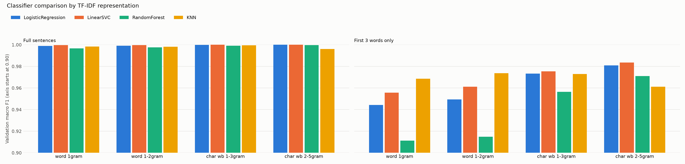
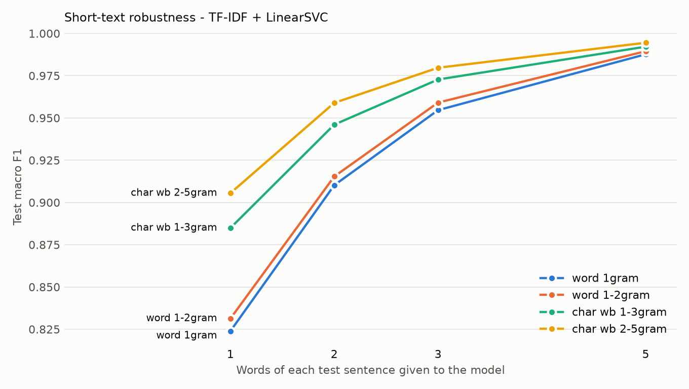
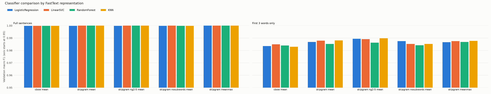
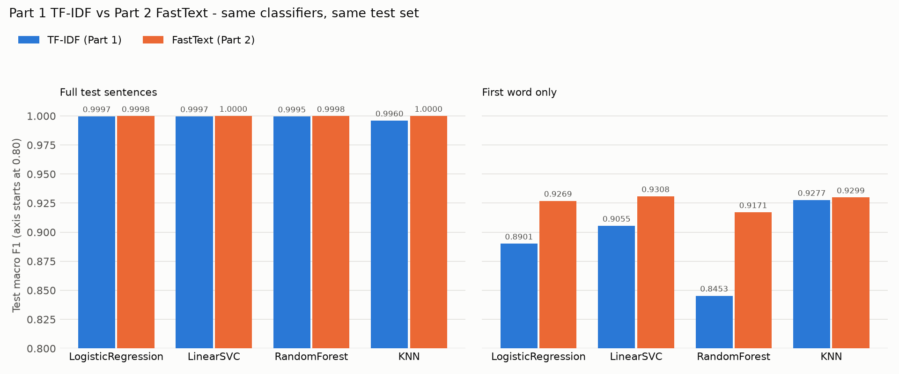
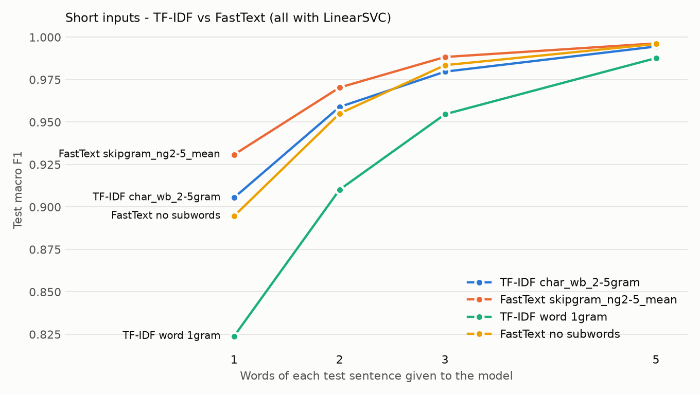
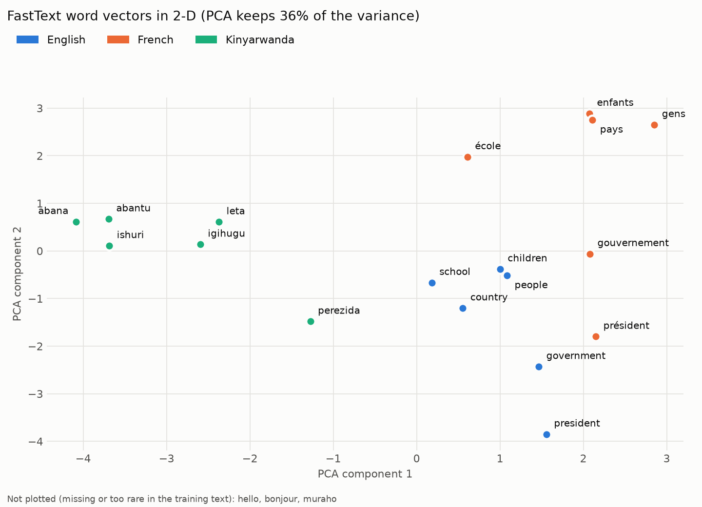

# AI Document Reader — TF-IDF Baseline and Word-Embedding Improvement

> Upload a PDF, DOCX or TXT document; the system extracts and cleans the text,
> detects its language (English / French / Kinyarwanda), summarises it, answers
> questions about it and reads it aloud.
>
> * **Part 1 — TF-IDF baseline:** language detection with a sparse TF-IDF
>   representation + traditional classifiers (§4–§13).
> * **Part 2 — Word-embedding improvement:** the same experiment with **FastText
>   word embeddings**, compared with Part 1 on the same data, split and metrics
>   (§19). Both models are kept and can be selected in the app.

```
                      AI DOCUMENT READER
                              │
                         Upload File  (PDF · DOCX · TXT)
                              │
                              ▼
                       Text Extraction  (PyMuPDF · python-docx · Python I/O)
                              │
                              ▼
                       NLP Processing   (cleaning · tokenisation)
                              │
          ┌───────────────────┼─────────────────────────┐
          ▼                   ▼                         ▼
  Language Detection       Summary                     Q&A
  TF-IDF (Part 1) or       extractive (frequency)      patterns + TF-IDF retrieval
  FastText (Part 2) + ML   or pretrained DistilBART    + pretrained extractive QA
  ★ main ML task ★
          │                   │                         │
          └───────────────────┼─────────────────────────┘
                              ▼
                             TTS   (gTTS · pyttsx3 · pretrained MMS-TTS)
                              │
                              ▼
                            Speech
```

---

## Quick start — run the app step by step

The project is the `ai-document-reader` folder of the GitHub repository
[mclaire12/KLab-tekher-program](https://github.com/mclaire12/KLab-tekher-program).
The dataset and **both trained language-detection models are included**, so you
do **not** need to train anything to run the app.

### What you need first

| Requirement | Notes |
|---|---|
| **Python 3.10 – 3.13** | check with `python --version` (Windows: tick *Add python.exe to PATH* when installing) |
| **Git** | to clone the repository (or download the ZIP from GitHub) |
| **Free disk space** | ≈ 2 GB for the packages (mostly PyTorch), plus up to ≈ 3.5 GB if you use all the pretrained features (downloaded on first use, see below) |
| **Internet connection** | for the installation and the first use of some features (see *First run* below) |

### Steps

**1. Clone the repository and open the project folder**

```bash
git clone https://github.com/mclaire12/KLab-tekher-program.git
cd KLab-tekher-program/ai-document-reader
```

**2. Create a virtual environment** (keeps this project's packages separate)

```bash
python -m venv .venv
```

**3. Activate it** — your prompt then starts with `(.venv)`

```bash
# Windows (PowerShell or Command Prompt)
.venv\Scripts\activate

# macOS / Linux
source .venv/bin/activate
```

> Windows PowerShell may refuse to run the activation script. Run this once, then
> activate again: `Set-ExecutionPolicy -Scope CurrentUser RemoteSigned`

**4. Install the dependencies** (5–10 minutes the first time)

```bash
python -m pip install --upgrade pip
python -m pip install -r requirements.txt
```

**5. Start the app**

```bash
python -m streamlit run app.py
```

Your browser opens <http://localhost:8501>. (If it does not, open that address
yourself.) Stop the app with **Ctrl + C** in the terminal.

**6. Use it**

1. Drag a **PDF, DOCX or TXT** file into *Upload your document* — try the files
   in [`samples/`](samples/).
2. Choose the **Language Detection Model**: *FastText Embeddings (Part 2)* or
   *TF-IDF Baseline (Part 1)*. The **Document Information** card shows the
   language, the confidence, the representation and model used, and what the
   other model predicts.
3. Explore the tabs: **Document** (extracted text), **Summary**, **Ask AI**
   (ask e.g. *"What is the phone number of the owner?"*), **Read** (listen).

**Every time you come back later:** open a terminal in `ai-document-reader`,
activate the environment (step 3) and start the app (step 5).

### First run: automatic downloads

Some features use pretrained models that are downloaded once, on first use, and
then cached on your computer. The app works without them and falls back to
simpler methods if a download is not possible.

| Feature | Pretrained model | Download |
|---|---|---|
| Ask AI — exact answers to general questions | `deepset/xlm-roberta-base-squad2` | ≈ 1.1 GB (the first question takes about 15–20 s to load it) |
| Summary — *Abstractive* option (English only) | `sshleifer/distilbart-cnn-12-6` | ≈ 2.3 GB |
| Read — Kinyarwanda voice | `facebook/mms-tts-kin` | ≈ 140 MB |
| Read — English/French voice (gTTS) | Google Text-to-Speech | needs internet every time |

Language detection, text extraction, the extractive summary, the phone/e-mail/name
answers in Ask AI and the offline voice need **no** download.

### Optional: re-train and re-evaluate the models

Not needed to run the app; use this to reproduce the results in this README.

```bash
python training/prepare_dataset.py                   # only if data/ is missing (downloads the corpora)
python training/train_language_detection_tfidf.py    # Part 1 - TF-IDF          (~1 min)
python training/train_language_detection_embeddings.py   # Part 2 - FastText    (~5 min)
python training/compare_representations.py           # Part 1 vs Part 2 + error analysis (~1 min)
python training/visualize_embeddings.py              # optional chart of the word vectors
```

Results are written to [`results/`](results/) — a one-page summary is in
[`results/part2_summary.md`](results/part2_summary.md).

### Troubleshooting

| Problem | Solution |
|---|---|
| `No module named 'pymupdf'` (or another package) | the app runs in a different Python than the one you installed into. Activate `.venv` (step 3) and always use `python -m pip …` and `python -m streamlit …` |
| `'streamlit' is not recognized` | use `python -m streamlit run app.py` |
| `python` not found (Windows) | try `py` instead of `python`, or reinstall Python with *Add to PATH* |
| *Language detection model has not been trained yet* | the `models/` folder is missing; run the two training commands above |
| PDF shows *No text could be extracted* | it is a scanned PDF (images only); OCR is not supported |
| No sound with gTTS | gTTS needs internet; choose *Offline system voice* in *Voice options* |
| Offline voice fails on Linux | install espeak: `sudo apt install espeak-ng` |
| Port 8501 already in use | `python -m streamlit run app.py --server.port 8502` |
| `OSError … No such file or directory … Windows Long Path support` during step 4 | the folder path is too long for Windows (260-character limit). Clone into a short path such as `C:\projects\`, or [enable long paths](https://pip.pypa.io/warnings/enable-long-paths), then repeat steps 2–4 |

---

## Dependencies

All are listed in [`requirements.txt`](requirements.txt) and installed by step 4.

| Package | Used for | Needed for |
|---|---|---|
| `numpy`, `pandas` | data handling | everything |
| `scikit-learn` | TF-IDF, the 4 classifiers, metrics, PCA | language detection (both parts) |
| `gensim` | **FastText** word embeddings | language detection, Part 2 |
| `joblib` | saving / loading trained models | language detection |
| `matplotlib` | charts in `results/` | training scripts only |
| `requests` | downloading the dataset | `prepare_dataset.py` only |
| `pymupdf` | reading **PDF** files | upload |
| `python-docx` | reading **DOCX** files | upload |
| `streamlit` | the web application | the app |
| `gTTS` | English / French speech (online) | Read tab |
| `pyttsx3` | offline system voice | Read tab |
| `torch`, `transformers`, `sentencepiece` | running the pretrained models (Ask AI, abstractive summary, Kinyarwanda voice) | optional features — the app falls back without them |

Tested with Python 3.13, scikit-learn 1.9, gensim 4.4, streamlit 1.64, torch 2.x
(CPU) on Windows 11.

---

## How the project works

```
                 you upload a PDF / DOCX / TXT
                              │
   1. Text extraction         src/extraction/        PyMuPDF · python-docx · Python
                              │
   2. Preprocessing           src/preprocessing/     lowercase, remove punctuation/digits/URLs,
                              │                      keep accents and apostrophes, tokenize
                              │
   3. Language detection      src/language_detection/   ★ the machine-learning part ★
      text → representation → classifier → English / French / Kinyarwanda + confidence
        Part 1: TF-IDF character n-grams      + LinearSVC
        Part 2: FastText word embeddings      + KNN          (choose in the app)
                              │
   4. Features using the text
      Summary    src/summarization/      most important sentences (or pretrained model, English)
      Ask AI     src/question_answering/ exact answer copied from the document + its source
      Read       src/tts/                text-to-speech in the detected language
```

* **Training** (`training/`) happens offline: the scripts learn the language
  models from 23,973 labelled sentences and test them on 5,994 other sentences.
  The app only **loads** the saved models from `models/language_detection/`.
* `training/common.py` contains everything shared by Part 1 and Part 2 (data,
  split, classifiers, metrics), so the only difference between the parts is the
  text representation.

---

## Part 1 vs Part 2 at a glance

| | **Part 1 — TF-IDF baseline** | **Part 2 — FastText embeddings** |
|---|---|---|
| Idea | count character patterns, weight rare ones higher | learn a vector per word from the words around it, built from character pieces |
| Representation | sparse, 99,533 numbers per text (mostly 0) | dense, 100 numbers per text (mean of word vectors) |
| Captures similarity between words? | no | yes (spelling and context) |
| Unseen words | only through shared character n-grams | vector built from character n-grams |
| Selected classifier | LinearSVC (calibrated) | KNN (5 neighbours) |
| Same data, split, classifiers, metrics? | ✅ | ✅ (identical split fingerprint) |
| Test accuracy / macro F1 (full sentences) | 0.9997 / 0.9997 (2 errors) | 1.0000 / 1.0000 (0 errors) |
| Macro F1 — first 2 words only | 0.9581 | **0.9708** |
| Macro F1 — first word only | 0.9043 | **0.9299** |
| Training time | 2.7 s | 78.8 s |
| Interpretability | high (readable n-grams) | low |
| Code | `training/train_language_detection_tfidf.py` | `training/train_language_detection_embeddings.py` |

**In one sentence:** on full sentences both are almost perfect; FastText helps
mainly on **short texts and rare words, especially Kinyarwanda**, at the cost of
slower training and less interpretability. Details in §13 (Part 1) and §19 (Part 2).

## How to test Part 1 vs Part 2 yourself

### A. In the app (live demo, 5 minutes)

1. Start the app (Quick start, step 5): `python -m streamlit run app.py`.
2. Upload a file from [`samples/part1_vs_part2/`](samples/part1_vs_part2/).
3. Read the **Document Information** card: *Language*, *Confidence*,
   *Representation* and *Model used* for the selected model, and the line
   **"For comparison, … predicts: …"** for the other model.
4. Switch the **Language Detection Model** between *FastText Embeddings (Part 2)*
   and *TF-IDF Baseline (Part 1)*; the card updates immediately.
5. Repeat with the next file.

Expected results (measured with the committed models):

| File | Text | True language | TF-IDF (Part 1) | FastText (Part 2) | What it shows |
|---|---|---|---|---|---|
| `01_leta_kinyarwanda.txt` | leta | Kinyarwanda | French ✗ (84%) | **Kinyarwanda ✓** (100%) | short Kinyarwanda word: few distinctive character n-grams for TF-IDF |
| `02_polisi_kinyarwanda.txt` | polisi | Kinyarwanda | French ✗ (58%) | **Kinyarwanda ✓** (100%) | spelling close to French *police*; FastText learned the word from Kinyarwanda contexts |
| `03_moto_kinyarwanda.txt` | moto | Kinyarwanda | English ✗ (94%) | **Kinyarwanda ✓** (100%) | high TF-IDF confidence can still be wrong |
| `04_peter_english.txt` | Peter | English | French ✗ (66%) | **English ✓** (100%) | names: FastText uses the contexts the word appeared in |
| `05_once_english.txt` | once | English | French ✗ (53%) | **English ✓** (100%) | the letters *-nce* look French; the word vector knows English usage |
| `06_code_switching_kinyarwanda.txt` | Ni ukwica intellectuellement generation yose. | Kinyarwanda | French ✗ (59%) | **Kinyarwanda ✓** (100%) | mixed-language sentence (Part 1's test error) |
| `07_names_in_french_sentence.txt` | Jennifer Aniston et Steve Carrell dans la série The Morning Show. | French | English ✗ (60%) | **French ✓** (100%) | many English names in a French sentence (Part 1's test error) |
| `08_trump_english.txt` | trump | English | **English ✓** (72%) | French ✗ (60%) | **FastText is not always better**: the French news data mentions Trump often, so the vector is near French words |
| `09_muraho_kinyarwanda.txt` | Muraho | Kinyarwanda | **Kinyarwanda ✓** (97%) | **Kinyarwanda ✓** (100%) | easy words: both correct |

Full documents (e.g. `samples/kinyarwanda_sample.docx`) are detected correctly by
**both** models — the difference shows on short or unusual text, exactly as in
the evaluation (§19.11). You can also type any word into a `.txt` file and upload it.

> Confidence ≠ correctness: for KNN (Part 2), confidence is the share of the 5
> nearest training sentences that agree, so it is often 100%. *moto* shows that
> TF-IDF can be 94% confident and still wrong.

### B. Reproduce the measured comparison (3 commands)

```bash
python training/train_language_detection_tfidf.py        # Part 1 results  (~1 min)
python training/train_language_detection_embeddings.py   # Part 2 results  (~5 min)
python training/compare_representations.py               # Part 1 vs Part 2 (~1 min)
```

The last command first checks that both models used **the same data split**,
then prints, per classifier, accuracy / precision / recall / macro F1 for both
representations and the **difference (FastText − TF-IDF)**, on full sentences
and on 1-, 2-, 3- and 5-word inputs, plus the error analysis (printed as tables).
Key numbers to look for in the *Deployed models* and *Error analysis* tables:

| | TF-IDF | FastText |
|---|---:|---:|
| Macro F1, full test sentences | 0.9997 | 1.0000 |
| Macro F1, first word only | 0.9043 | 0.9299 |
| First word: correct only with this model | 72 | 227 |

### C. Look at the evidence

| Open | Shows |
|---|---|
| [`results/part2_summary.md`](results/part2_summary.md) | one-page summary with the before/after table |
| [`results/comparison.png`](results/comparison.png) | macro F1 per classifier, TF-IDF vs FastText (full sentences and single words) |
| [`results/comparison_short_text.png`](results/comparison_short_text.png) | how both behave as the input gets shorter, including the no-subword ablation |
| [`results/comparison.csv`](results/comparison.csv) | the numbers with the difference column |
| [`results/error_analysis.csv`](results/error_analysis.csv) | every text where the two models disagree (open in Excel) |
| [`results/fasttext_embedding_pca.png`](results/fasttext_embedding_pca.png) | the word vectors in 2-D, grouped by language |

---

---

## Table of contents

* [Quick start — run the app step by step](#quick-start--run-the-app-step-by-step)
* [Dependencies](#dependencies) · [How the project works](#how-the-project-works) · [Part 1 vs Part 2 at a glance](#part-1-vs-part-2-at-a-glance) · [How to test Part 1 vs Part 2 yourself](#how-to-test-part-1-vs-part-2-yourself)

1. [Problem statement](#1-problem-statement)
2. [Objectives](#2-objectives)
3. [Features](#3-features)
4. [Part 1 — TF-IDF Baseline](#4-part-1--tf-idf-baseline)
5. [NLP pipeline](#5-nlp-pipeline)
6. [Dataset](#6-dataset)
7. [TF-IDF representation](#7-tf-idf-representation)
8. [Models tested](#8-models-tested)
9. [Installation](#9-installation)
10. [Training](#10-training)
11. [Running the application](#11-running-the-application)
12. [Evaluation metrics](#12-evaluation-metrics)
13. [Actual results](#13-actual-results)
14. [Screenshots](#14-screenshots)
15. [Which model does what](#15-which-model-does-what)
16. [Project structure](#16-project-structure)
17. [Limitations](#17-limitations)
18. [Future improvements](#18-future-improvements)
19. [Part 2 — Word Embedding Improvement](#19-part-2--word-embedding-improvement)
    — [results](#1910-results) · [before/after](#1911-beforeafter-comparison) · [error analysis](#1912-error-analysis)
20. [How the Machine Learning Works](#20-how-the-machine-learning-works)

---

## 1. Problem statement

Documents reach readers in many formats and, in Rwanda, frequently in one of three
languages: **Kinyarwanda, English or French**. Before a system can summarise,
search or read a document aloud, it must know *which language* it is dealing
with — the right summariser, question-answering behaviour and text-to-speech
voice all depend on it. Kinyarwanda is also a low-resource language that many
off-the-shelf tools do not support well.

This project builds an **AI Document Reader** whose central, supervised NLP task
is **language identification**, implemented as a transparent TF-IDF +
machine-learning baseline that can later be compared with word embeddings.

## 2. Objectives

- Extract text reliably from PDF, DOCX and TXT files.
- Build an explainable preprocessing pipeline that respects French accents and
  Kinyarwanda apostrophe contractions.
- Train and **fairly compare** four traditional classifiers on several TF-IDF
  representations (word vs. character n-grams) using one fixed, stratified split.
- Report **real, reproducible** metrics (accuracy, precision, recall, F1, macro F1,
  confusion matrix) — nothing invented.
- Integrate the best model into a Streamlit application with summary, question
  answering and text-to-speech.
- Keep the code modular so that **Part 2** can add word embeddings and compare
  (done: §19).

## 3. Features

| Tab | What it does | Technique |
|---|---|---|
| **Upload / Document Information** | filename, type, size, pages (PDF), detected language, confidence, representation and model used; **model selector: FastText (Part 2) or TF-IDF (Part 1)** | PyMuPDF, python-docx, trained language-detection models |
| **📄 Document** | full extracted text | PyMuPDF, python-docx |
| **📝 Summary** | extractive summary (any language) or abstractive summary (English) | frequency-based sentence scoring / pretrained `sshleifer/distilbart-cnn-12-6` |
| **❓ Ask AI** | gives the **exact answer** copied from the document (e.g. only the phone number) and shows its source | patterns + TF-IDF retrieval + pretrained extractive QA model |
| **🔊 Read** | reads the document, the summary or custom text aloud at 0.75x–1.5x speed | gTTS, pyttsx3, pretrained `facebook/mms-tts-kin` |

Model evaluation is **not** part of the interface: it is produced in code by the
training and comparison scripts (`results/`) for the report and presentation.

## 4. Part 1 — TF-IDF Baseline

This version is **intentionally a baseline**. Its machine-learning component
uses a *traditional, sparse* text representation — **TF-IDF** — with classic
classifiers. It deliberately does **not** use any word embeddings (no Word2Vec,
GloVe, FastText, sentence-transformers or transformer embeddings) for language
detection.

Why start with a baseline?

- It gives a **reference score** that any more complex method must beat.
- It is **fully explainable**: every feature is a visible word or character
  sequence with a weight.
- It is **fast and cheap** (training takes seconds on a laptop CPU).
- In Part 2 we will keep the same data, split, metrics and application and
  only change the representation, so the comparison is fair.

## 5. NLP pipeline

```
Raw document
  │  src/extraction/          PDF → PyMuPDF · DOCX → python-docx · TXT → UTF-8 (fallback cp1252/latin-1)
  ▼
Raw text
  │  src/preprocessing/       repair mojibake (’ → ') · Unicode NFC · lowercase
  │                           remove URLs, e-mails, digits, punctuation
  │                           keep accents (é, ç) and in-word apostrophes (nk'abandi, l'école)
  │                           collapse whitespace · drop empty documents
  ▼
Clean text ── tokenize() ──► tokens (for statistics, summary and Q&A)
  │
  │  src/language_detection/features.py   TfidfVectorizer (char_wb 2–5-grams)
  ▼
Sparse TF-IDF vector (99,533 dimensions)
  │  src/language_detection/detector.py   LinearSVC (probability-calibrated)
  ▼
Predicted language + confidence
```

**Stopwords.** Stopword removal is available (`remove_stopwords`) but is **off**
for language detection: function words such as *the*, *le*, *na* are among the
most informative clues for identifying a language. Stopwords are only removed
when scoring sentences for the extractive summary. The Kinyarwanda list is kept
deliberately short because Kinyarwanda is agglutinative — many grammatical
elements are prefixes attached to content words, so aggressive removal would
delete meaning.

### How Ask AI finds an exact answer

```
Question ─┬─► 1. Exact patterns (rule-based, explainable)
          │      phone · e-mail · link · owner's name · address · "Label: value" lines
          │      owner's details = first occurrence in the document;
          │      "phone of <Name>" = occurrence closest to that name
          │
          ├─► 2. TF-IDF retrieval of the top passages (+ start of the document)
          │      → pretrained extractive QA model (deepset/xlm-roberta-base-squad2)
          │        selects the exact answer span, or "no answer"
          │
          └─► 3. Fallback without the QA model: best-matching sentence
```

Example: *"what are the name of the owner and its phone number?"* →
**Name: Alice Mukamana · Phone: +250 781 234 567** (fictional test CV).

## 6. Dataset

| | |
|---|---|
| **Source** | [Leipzig Corpora Collection](https://wortschatz.uni-leipzig.de/en/download), Universität Leipzig — licence **CC BY 4.0** |
| **English** | `eng_news_2020_10K` — news sentences (2020) |
| **French** | `fra_news_2020_10K` — news sentences (2020) |
| **Kinyarwanda** | `kin_community_2017_10K` — web/community sentences (2017) |
| **Format** | `data/language_detection/{train,test}.csv` with columns `text,language` |
| **Size after cleaning** | 29,967 real sentences; balanced: 9,989 per language |
| **Split** | stratified, seed 42 → `train.csv` 23,973 · `test.csv` 5,994 |
| **Inside training** | `train.csv` is split again (stratified 80/20, seed 42) → 19,178 train · 4,795 validation |

The dataset is built by `training/prepare_dataset.py`, which downloads the
three corpora, removes sentences shorter than 3 words and duplicates, balances
the classes, and writes the split. No sentence is generated or synthetic.
See [data/language_detection/README.md](data/language_detection/README.md) for
the exact format and for how to use your own data instead.

```csv
text,language
"Hello, how are you today?",english
"Bonjour, comment allez-vous?",french
"Muraho, amakuru yawe?",kinyarwanda
```

The training script **stops with a clear error** if either CSV is missing, has
wrong columns, contains unknown labels, or has fewer than 10 samples for a language.

Citation: D. Goldhahn, T. Eckart & U. Quasthoff (2012). *Building Large Monolingual
Dictionaries at the Leipzig Corpora Collection: From 100 to 200 Languages.* LREC 2012.

## 7. TF-IDF representation

scikit-learn `TfidfVectorizer`, `sublinear_tf=True` (uses 1 + log(tf)), L2
normalisation, `min_df=2`. Four configurations are compared
(`src/language_detection/features.py`):

| Config | Analyzer | n-grams | Vocabulary | Captures |
|---|---|---|---|---|
| `tfidf_word_1gram` | word | 1 | 23,397 | individual words |
| `tfidf_word_1-2gram` | word | 1–2 | 56,105 | words + short phrases (*de la*, *mu Rwanda*) |
| `tfidf_char_wb_1-3gram` | char (within word boundaries) | 1–3 | 8,994 | letters and short spelling patterns |
| `tfidf_char_wb_2-5gram` | char (within word boundaries) | 2–5 | 99,533 | longer spelling patterns: *-tion*, *eau*, *nyi*, *rw*, *th* |

**Why character n-grams suit language identification:** each language has
typical letter sequences (English *th*, *ing*; French *eau*, *ois*, *é*;
Kinyarwanda *nyi*, *cy*, *rw*, frequent *aba-/umu-* prefixes). Character n-grams
recognise these even in words never seen in training, and they still work when
the text is only one or two words long — see the short-text results below.

## 8. Models tested

All from scikit-learn, all trained on exactly the same TF-IDF features and split
(`src/language_detection/classifiers.py`):

| Classifier | Settings | Idea |
|---|---|---|
| Logistic Regression | `C=10, max_iter=2000` | linear model, outputs probabilities |
| LinearSVC | `C=1.0` | linear max-margin separator; no probabilities, outputs decision scores |
| Random Forest | `n_estimators=200` | ensemble of decision trees |
| K-Nearest Neighbors | `k=5, metric=cosine` | majority vote of the 5 most similar training sentences |

**Probability calibration.** LinearSVC does not output probabilities, but the
app shows a confidence. After selection, the chosen LinearSVC is therefore
wrapped in `CalibratedClassifierCV` (sigmoid / Platt scaling, 5-fold
cross-validation on the training split only). The deployed, calibrated model is
re-evaluated on the test set (§13.2) and gives the same test results.

**Model selection rule:** highest **validation macro F1**. When models tie, the
tie is broken by validation macro F1 on **3-word snippets** of the validation
sentences (robustness to short text), then by training time. The test set is
**never** used for selection — only for the final report.

## 9. Installation

See **[Quick start](#quick-start--run-the-app-step-by-step)** (steps 1–4) and
**[Dependencies](#dependencies)**.

> **Important:** install the packages into the **same** Python environment that
> runs Streamlit. Using `python -m pip` and `python -m streamlit` (with the
> environment activated) guarantees this.

## 10. Training

```bash
# 1. Build the dataset from the real Leipzig corpora (≈ 8 MB download, cached)
python training/prepare_dataset.py

# 2. Part 1 - train, compare and evaluate all TF-IDF configurations x classifiers
python training/train_language_detection_tfidf.py

# 3. Part 2 - train FastText embeddings and evaluate all configurations x classifiers
python training/train_language_detection_embeddings.py

# 4. Part 1 vs Part 2 - comparison, error analysis, charts
python training/compare_representations.py

# 5. Optional - 2-D visualisation of the FastText word vectors
python training/visualize_embeddings.py
```

Part 1 takes about one minute, Part 2 about five minutes on a laptop CPU.
Both scripts share `training/common.py` (data, split, classifiers, metrics,
selection, calibration), so they differ only in the representation. Options:

```bash
python training/train_language_detection_tfidf.py --configs tfidf_char_wb_2-5gram tfidf_word_1gram
python training/train_language_detection_tfidf.py --classifiers LogisticRegression LinearSVC
python training/train_language_detection_tfidf.py --seed 42
python training/train_language_detection_embeddings.py --configs fasttext_skipgram_mean --classifiers LinearSVC
```

**Outputs**

| Path | Content |
|---|---|
| `models/language_detection/tfidf/vectorizer.pkl` | fitted TF-IDF vectorizer of the selected configuration |
| `models/language_detection/tfidf/model.pkl` | selected classifier |
| `models/language_detection/tfidf/metadata.json` | vectorizer settings, classifier + parameters, languages, metrics, preprocessing, training date, version, seed |
| `models/language_detection/tfidf/classifiers/*.pkl` | all four classifiers for the selected config (git-ignored; ~100 MB because of Random Forest) |
| `results/tfidf_results.csv` | every config × classifier × split: accuracy, macro precision/recall/F1, weighted F1, 3-word F1, training time |
| `results/tfidf_config_comparison.csv` | best and mean validation F1 per TF-IDF config |
| `results/tfidf_short_text_robustness.csv` | test macro F1 on the first 1/2/3/5 words of every sentence |
| `results/tfidf_classification_report.txt` | per-class report + confusion matrix of the selected model |
| `results/tfidf_confusion_matrix.png`, `tfidf_confusion_matrices_all_classifiers.png`, `tfidf_model_comparison.png`, `tfidf_short_text_robustness.png` | charts |
| `results/tfidf_training_log.txt` | full console output of the run reported below |
| `models/language_detection/fasttext/fasttext.model` | Part 2: trained FastText word + subword vectors (gensim KeyedVectors) |
| `models/language_detection/fasttext/classifier.pkl`, `metadata.json` | Part 2: selected classifier and its metadata (FastText settings, metrics, split fingerprint) |
| `results/fasttext_*` | Part 2: same files as the `tfidf_*` ones |
| `results/comparison*.csv`, `comparison*.png` | Part 1 vs Part 2, same classifiers, full sentences and short inputs |
| `results/error_analysis.csv`, `error_analysis_summary.csv`, `oov_analysis.csv` | where the two representations disagree, and why |
| `results/fasttext_embedding_pca.png`, `embedding_words.csv`, `embedding_neighbours.csv` | word-vector visualisation |
| `results/part2_summary.md` | one-page results summary for the presentation |

## 11. Running the application

See **[Quick start](#quick-start--run-the-app-step-by-step)** (steps 5–6):
`python -m streamlit run app.py`, then open <http://localhost:8501>.

`samples/` contains an English TXT, a French PDF and a Kinyarwanda DOCX built
from real held-out test sentences (they are unrelated sentences, so summaries
and answers are only meant to demonstrate the mechanics).

## 12. Evaluation metrics

| Metric | Meaning |
|---|---|
| **Accuracy** | share of sentences whose language was predicted correctly |
| **Precision** (per language) | of the sentences predicted as language L, how many really are L |
| **Recall** (per language) | of the sentences that really are L, how many were found |
| **F1-score** | harmonic mean of precision and recall |
| **Macro F1** | average of the per-language F1 scores — every language counts equally (important so Kinyarwanda is not hidden by the others) |
| **Confusion matrix** | rows = true language, columns = predicted language |

**Confidence ≠ accuracy.** In the app, *confidence* (the calibrated probability
of the predicted language) describes how
strongly the model prefers a language **for that one document**. *Accuracy/F1*
describe how often the model was right on the **held-out test set**.

## 13. Actual results

All numbers below were produced by `python training/train_language_detection_tfidf.py`
on 2026-10-02 (seed 42) and are copied from the files in `results/`. Re-running
the script reproduces them; small differences in training *time* are expected.

### 13.1 All models (sorted by selection rule)

Macro-averaged. Validation = 4,795 sentences, test = 5,994 sentences.

| TF-IDF config | Classifier | Val acc | Val macro F1 | Val F1 (3 words) | Test acc | Test precision | Test recall | Test macro F1 |
|---|---|---:|---:|---:|---:|---:|---:|---:|
| **char_wb 2–5** | **LinearSVC** ★ | 1.0000 | **1.0000** | **0.9835** | 0.9997 | 0.9997 | 0.9997 | **0.9997** |
| char_wb 2–5 | LogisticRegression | 1.0000 | 1.0000 | 0.9808 | 0.9997 | 0.9997 | 0.9997 | 0.9997 |
| char_wb 1–3 | LinearSVC | 1.0000 | 1.0000 | 0.9754 | 0.9998 | 0.9998 | 0.9998 | 0.9998 |
| char_wb 1–3 | LogisticRegression | 0.9998 | 0.9998 | 0.9734 | 0.9997 | 0.9997 | 0.9997 | 0.9997 |
| char_wb 2–5 | RandomForest | 0.9996 | 0.9996 | 0.9711 | 0.9995 | 0.9995 | 0.9995 | 0.9995 |
| word 1–2 | LinearSVC | 0.9996 | 0.9996 | 0.9611 | 0.9997 | 0.9997 | 0.9997 | 0.9997 |
| word 1 | LinearSVC | 0.9996 | 0.9996 | 0.9556 | 0.9995 | 0.9995 | 0.9995 | 0.9995 |
| char_wb 1–3 | KNN | 0.9994 | 0.9994 | 0.9729 | 0.9990 | 0.9990 | 0.9990 | 0.9990 |
| char_wb 1–3 | RandomForest | 0.9992 | 0.9992 | 0.9565 | 0.9990 | 0.9990 | 0.9990 | 0.9990 |
| word 1–2 | LogisticRegression | 0.9992 | 0.9992 | 0.9495 | 0.9995 | 0.9995 | 0.9995 | 0.9995 |
| word 1 | LogisticRegression | 0.9990 | 0.9990 | 0.9443 | 0.9993 | 0.9993 | 0.9993 | 0.9993 |
| word 1 | KNN | 0.9983 | 0.9983 | 0.9685 | 0.9978 | 0.9978 | 0.9978 | 0.9978 |
| word 1–2 | KNN | 0.9981 | 0.9981 | 0.9738 | 0.9988 | 0.9988 | 0.9988 | 0.9988 |
| word 1–2 | RandomForest | 0.9975 | 0.9975 | 0.9149 | 0.9978 | 0.9978 | 0.9978 | 0.9978 |
| word 1 | RandomForest | 0.9967 | 0.9967 | 0.9113 | 0.9975 | 0.9975 | 0.9975 | 0.9975 |
| char_wb 2–5 | KNN | 0.9960 | 0.9960 | 0.9611 | 0.9960 | 0.9960 | 0.9960 | 0.9960 |

★ **Selected model: LinearSVC + TF-IDF character (word-boundary) 2–5-grams**
(deployed with probability calibration, see §8).
Three combinations tie at validation macro F1 = 1.0000; the tie-break (3-word
validation F1) selects LinearSVC + char_wb 2–5 (0.9835 vs 0.9808 and 0.9754).

### 13.2 Deployed model (calibrated LinearSVC) on the held-out test set

Calibration did not change any test prediction: the uncalibrated and
calibrated LinearSVC both reach accuracy and macro F1 = 0.9997.

```
              precision    recall  f1-score   support

     english     0.9995    1.0000    0.9997      1998
      french     0.9995    0.9995    0.9995      1998
 kinyarwanda     1.0000    0.9995    0.9997      1998

    accuracy                         0.9997      5994
   macro avg     0.9997    0.9997    0.9997      5994
```


Only **2 of 5,994** test sentences were misclassified, and both are instructive:

| True | Predicted | Sentence | Why |
|---|---|---|---|
| kinyarwanda | french | *Ni ukwica intellectuellement generation yose.* | code-switching: two of five words are French |
| french | english | *Jennifer Aniston et Steve Carrell dans la série "The Morning Show".* | dominated by English names and an English title |

### 13.3 Word vs. character n-grams

On **full sentences** every configuration is above 0.996 macro F1 — telling
these three languages apart from a complete sentence is easy for any reasonable
representation. The differences appear on **short text**:



Test macro F1 (LinearSVC) when the model only sees the **first N words** of
each test sentence (`results/tfidf_short_text_robustness.csv`):

| TF-IDF config | 1 word | 2 words | 3 words | 5 words |
|---|---:|---:|---:|---:|
| word 1-gram | 0.8239 | 0.9102 | 0.9546 | 0.9877 |
| word 1–2-gram | 0.8313 | 0.9153 | 0.9591 | 0.9895 |
| char_wb 1–3-gram | 0.8849 | 0.9460 | 0.9727 | 0.9922 |
| **char_wb 2–5-gram** | **0.9055** | **0.9589** | **0.9797** | **0.9945** |



**Conclusion.** Character n-grams perform better, especially on short inputs:
with a single word, char 2–5-grams reach 0.906 macro F1 vs. 0.824 for word
unigrams. A word model can only use words seen in training; a character model
still recognises spelling patterns in unseen words, names and inflections —
very relevant for Kinyarwanda, where one stem appears with many different
prefixes. Among classifiers, the linear models (LinearSVC, Logistic Regression)
are best and fastest on high-dimensional sparse TF-IDF; Random Forest is the
weakest on short text and the slowest; KNN is competitive on very short inputs
but the least accurate on full sentences with char 2–5-grams.

## 14. Screenshots

Captured from the running app (`samples/kinyarwanda_sample.docx` for the header,
`samples/french_sample.pdf` for the tabs, a fictional CV for Ask AI).

| FastText selected (Part 2) | TF-IDF selected (Part 1) |
|---|---|
|  |  |

| Document tab | Summary tab |
|---|---|
|  |  |
| **Ask AI tab** | **Read tab** |
|  |  |

Evaluation charts for the presentation are in `results/` (see §13).

## 15. Which model does what

| Task | Model / method | Trained by us? |
|---|---|---|
| **Language detection — Part 1** | TF-IDF char_wb 2–5-grams + **LinearSVC** (calibrated) | ✅ **yes** — `training/train_language_detection_tfidf.py` |
| **Language detection — Part 2** | FastText embeddings (skip-gram, subwords 2–5, mean pooling) + **KNN** | ✅ **yes**, embeddings and classifier — `training/train_language_detection_embeddings.py` |
| Extractive summary | frequency-based sentence scoring (no ML model) | — rule-based |
| Abstractive summary (English only, optional) | pretrained `sshleifer/distilbart-cnn-12-6` | ❌ no, pretrained |
| Question answering — contact details & fields | patterns for phone / e-mail / link, owner's name, address, `Label: value` lines | — rule-based |
| Question answering — other questions | TF-IDF passage retrieval (per document) + pretrained extractive QA model `deepset/xlm-roberta-base-squad2` | ❌ no, pretrained (retrieval index fitted per document) |
| TTS English/French | Google TTS (gTTS, online) or OS voices (pyttsx3, offline) | ❌ no |
| TTS Kinyarwanda | pretrained Meta MMS `facebook/mms-tts-kin` (CC-BY-NC 4.0); fallback = Swahili voice, labelled as an approximation | ❌ no |

The TF-IDF used for question answering is a **separate**, per-document
retrieval index; it is not the language-detection vectorizer.

## 16. Project structure

```
ai-document-reader/
├── app.py                                   Streamlit application (model selector)
├── README.md
├── requirements.txt
├── .gitignore
├── data/language_detection/
│   ├── README.md                            dataset format, source and licence
│   ├── train.csv                            23,973 real sentences (same for Part 1 and 2)
│   └── test.csv                              5,994 real sentences (same for Part 1 and 2)
├── training/
│   ├── prepare_dataset.py                   downloads + builds the dataset
│   ├── common.py                            shared pipeline: split, classifiers, metrics, selection
│   ├── train_language_detection_tfidf.py    Part 1 - TF-IDF
│   ├── train_language_detection_embeddings.py  Part 2 - FastText
│   ├── compare_representations.py           Part 1 vs Part 2 + error analysis
│   └── visualize_embeddings.py              PCA of word vectors
├── models/language_detection/
│   ├── tfidf/      vectorizer.pkl · model.pkl · metadata.json
│   └── fasttext/   fasttext.model · classifier.pkl · metadata.json
├── src/
│   ├── config.py                            paths, labels, seed
│   ├── extraction/                          PDF / DOCX / TXT → text
│   ├── preprocessing/                       cleaning, tokenisation, stopwords, stats
│   ├── language_detection/
│   │   ├── features.py                      Part 1 - TF-IDF configurations
│   │   ├── embeddings.py                    Part 2 - FastText training + document vectors
│   │   ├── classifiers.py                   the 4 classifiers (shared)
│   │   └── detector.py                      loads either model folder, predicts language
│   ├── summarization/                       extractive + optional pretrained abstractive
│   ├── question_answering/                  exact answers: patterns + retrieval + extractive QA model
│   └── tts/                                 gTTS, pyttsx3, MMS-TTS
├── results/                                 tfidf_* · fasttext_* · comparison* · error_analysis* · part2_summary.md
├── samples/                                 demo TXT / PDF / DOCX
└── docs/screenshots/
```

## 17. Limitations

- **Closed set of three languages.** Any other language (e.g. Swahili, Spanish)
  is still forced into English, French or Kinyarwanda. There is no "unknown" class.
- **Mixed-language documents** get a single label for the whole document; code-
  switching (common in Kinyarwanda writing) is a known error source (see §13.2).
- **Domain difference between classes.** English and French come from 2020 news,
  Kinyarwanda from 2017 web/community text. Part of what the model learns may be
  topic or style rather than language, and the near-perfect scores partly reflect
  how easy full-sentence identification of these three languages is.
- **Sentence-level training, document-level use.** The model is trained on
  sentences; documents are classified from their first 20,000 cleaned characters.
- **Confidence comes from calibration.** LinearSVC's probabilities are produced by
  Platt scaling; on very easy inputs they are often close to 100%, which says
  nothing about how the model behaves on other documents.
- **No OCR.** Scanned PDFs contain images, not text, and are reported as empty.
- **Q&A answers are only as good as their method.** Patterns assume common layouts
  (the owner's details come first in a CV; a name is a short capitalised line).
  The pretrained QA model can pick a wrong span — e.g. a past job for "current
  job" — or guess when the answer is not in the document. It never generates
  text, and the source is always shown so the answer can be checked. It does
  not support Kinyarwanda well.
- **Summaries.** The extractive method only selects sentences; the abstractive model
  is English-only and requires a large download.
- **Kinyarwanda TTS is limited.** It depends on a pretrained research model (non-
  commercial licence) that must be downloaded; there is no offline Kinyarwanda voice.

## 18. Future improvements

- Word embeddings for language detection — **done in Part 2 (§19)**; see §19.14
  for what could come next.
- Add an "other/unknown" class and a confidence threshold.
- Sentence- or paragraph-level detection to handle mixed-language documents.
- Larger and more varied data per language (same domains for all three).
- OCR (e.g. Tesseract) for scanned PDFs.
- Multilingual summarisation, including Kinyarwanda.

## 19. Part 2 — Word Embedding Improvement

Part 2 **continues this same codebase and Git history** (branch
`ai-document-reader-part2`, built on `ai-document-reader-part1`). Part 1 is kept
unchanged and runnable; Part 2 adds a second representation next to it.

```
PART 1                                   PART 2
Raw text                                 Same raw text
  ↓                                        ↓
Preprocessing (clean_text)               Same preprocessing
  ↓                                        ↓
TF-IDF (sparse, 99,533 dims)             FastText word embeddings (dense, 100 dims per word)
  ↓                                        ↓
                                         Document vector = mean of word vectors
  ↓                                        ↓
Traditional ML classifier                Same 4 classifiers, same settings
  ↓                                        ↓
Language detection                       Language detection
  ↓                                        ↓
Evaluation                               Same evaluation  ──►  compared with Part 1
```

### 19.1 Why Part 2 was necessary

Part 1 is a strong baseline on full sentences (test macro F1 0.9997), but it has
two weaknesses visible in its own results: performance drops on **short inputs**
(0.9055 macro F1 on a single word with LinearSVC) and TF-IDF has **no notion of
similarity between words** — two different spellings are unrelated features.
Kinyarwanda in particular has many word forms built from the same stem
(*ishuri*, *amashuri*, *y'ishuri*), many of which are rare or unseen in training.
Part 2 tests whether a dense, subword-aware representation helps.

### 19.2 What Part 1 used

* `TfidfVectorizer`, four configurations (word 1-gram, word 1–2-gram, char 1–3, char 2–5)
* Logistic Regression, LinearSVC, Random Forest, KNN
* Selected: **char_wb 2–5-grams + LinearSVC** (probability-calibrated)

### 19.3 What Part 2 changed

**Only the text representation.** Everything else is reused through
`training/common.py`: the same CSV files, cleaning, stratified train/validation
split (seed 42), classifiers and hyper-parameters, metrics, selection rule,
short-text test and calibration step. Both `metadata.json` files store the same
split fingerprint (`train 9119e708d3ce726b · validation 298416300f105cd3 ·
test 918d6f2a645d8230`), and `compare_representations.py` refuses to run if
they differ.

New code: `src/language_detection/embeddings.py` (FastText training + document
vectors), `training/train_language_detection_embeddings.py`,
`training/compare_representations.py`, `training/visualize_embeddings.py`, and
a model selector in `app.py`.

### 19.4 Why FastText

* **Subword information.** FastText builds each word vector from its character
  n-grams. This suits Kinyarwanda's rich morphology (prefixes such as *aba-*,
  *umu-*, *ama-*) and gives a vector even to words never seen in training.
  15.1% of Kinyarwanda test words never occur in the training text (English
  7.4%, French 8.5% — `results/oov_analysis.csv`).
* **Trainable on our own data.** Pre-trained Kinyarwanda vectors are scarce and
  were trained on different text; training on our training split keeps the
  comparison fair (same data as TF-IDF) and needs no external download.
* **Light enough** to train on a laptop CPU in about a minute (gensim).
* Character n-grams were already the best TF-IDF features in Part 1, so FastText
  is the natural "embedding" counterpart to compare with.

### 19.5 How FastText works

FastText (Bojanowski et al., 2017) is an extension of Word2Vec:

1. It reads the training sentences and learns, for each word, a 100-number
   vector such that words appearing in **similar contexts** get similar vectors
   (here: **skip-gram** — predict the neighbouring words within a window of 5).
2. Each word is represented as the sum of the vectors of its **character
   n-grams** (here 2–5 characters) plus the word itself:
   `ishuri → <i, is, sh, hu, ur, ri, i>, <is, ish, …, <ishuri>`.
3. An unseen word (e.g. *amashuri*) still gets a vector from the n-grams it
   shares with known words.

**FastText is not contextual.** Unlike BERT-style models, a word has one fixed
vector whatever sentence it appears in.

**Settings** (`FASTTEXT_DEFAULTS` in `src/language_detection/embeddings.py`, all configurable):

| Setting | Value | Meaning |
|---|---|---|
| `vector_size` | 100 | dimensions per word vector |
| `window` | 5 | context words on each side |
| `min_count` | 2 | words seen once get no own vector (their n-grams still do) |
| `epochs` | 20 | passes over the training text |
| `sg` | 1 (skip-gram) | learning algorithm (0 = CBOW, also tested) |
| `min_n`, `max_n` | 2, 5 in the selected model (3, 6 default) | character n-gram range |
| `bucket` | 50,000 | hash buckets for n-gram vectors (50k vs 100k changed validation F1 by ≤ 0.002 but halves the file) |
| `negative` | 5 | negative sampling |
| `seed`, `workers` | 42, 1 | with a deterministic hash function → reproducible training |
| training data | training split only | unsupervised: no labels, no validation/test text |

**TF-IDF vs FastText**

| | TF-IDF (Part 1) | FastText (Part 2) |
|---|---|---|
| Vector type | **sparse**: almost all values are 0 | **dense**: every value used |
| Size | high-dimensional (99,533 features) | low-dimensional (100 per word / document) |
| Based on | how often n-grams occur (frequency × rarity) | which words occur near each other (prediction task) |
| Word similarity | none — every feature is independent | similar contexts / spellings → similar vectors |
| Unseen words | character n-grams still match, word n-grams do not | vector built from character n-grams |
| Interpretability | high — each feature is a readable n-gram | low — dimensions have no direct meaning |
| Training cost | 2.7 s | 78.8 s |
| Contextual? | no | **no** |

### 19.6 How document vectors were created

A classifier needs **one fixed-size vector per text**, but texts contain
different numbers of words. Each text is therefore turned into a document
vector by averaging its word vectors (`FastTextDocumentVectorizer`):

```
"abana bagiye ku ishuri"
  → v(abana), v(bagiye), v(ku), v(ishuri)        4 × 100 numbers
  → mean                                          1 × 100 numbers
  → divide by its length (L2 normalisation, as TF-IDF rows in Part 1)
```

Texts with no words become a zero vector. As one simple alternative,
**mean + max pooling** (mean and element-wise maximum concatenated, 200 numbers)
was also tested.

### 19.7 Which classifiers were tested

The **same four classifiers with the same settings** as Part 1 (§8): Logistic
Regression, LinearSVC, Random Forest, KNN (k = 5, cosine). Five FastText
configurations were tested with each (20 models):

| Config | What it tests |
|---|---|
| `cbow_mean` | CBOW instead of skip-gram |
| `skipgram_mean` | skip-gram, n-grams 3–6 (gensim default) |
| `skipgram_ng2-5_mean` | n-grams 2–5, like the best TF-IDF features |
| `skipgram_nosubwords_mean` | **ablation**: no character n-grams = plain word vectors |
| `skipgram_meanmax` | mean + max pooling instead of mean |

### 19.8 Dataset used

Exactly the Part 1 dataset (§6): the same `train.csv` (23,973 sentences) and
`test.csv` (5,994 sentences), the same 19,178 / 4,795 train / validation split.
No new data was downloaded.

### 19.9 Evaluation methodology

Identical to Part 1: accuracy, macro precision, macro recall, macro F1,
classification report and confusion matrix on the held-out test set; model
selection by validation macro F1 with the 3-word tie-break; the same
short-text test (first 1 / 2 / 3 / 5 words of each test sentence).
`compare_representations.py` then compares each classifier across the two
representations, computes **difference = FastText − TF-IDF**, compares the two
deployed models and runs the error analysis.

### 19.10 Results

All numbers were produced by `python training/train_language_detection_embeddings.py`
on 2026-10-02 (`results/fasttext_results.csv`, `results/fasttext_training_log.txt`).

| FastText config | Classifier | Val acc | Val macro F1 | Val F1 (3 words) | Test acc | Test precision | Test recall | Test macro F1 |
|---|---|---:|---:|---:|---:|---:|---:|---:|
| **skipgram ng2-5 mean** | **KNN** ★ | 1.0000 | **1.0000** | **0.9898** | 1.0000 | 1.0000 | 1.0000 | **1.0000** |
| skipgram ng2-5 mean | LinearSVC | 1.0000 | 1.0000 | 0.9892 | 1.0000 | 1.0000 | 1.0000 | 1.0000 |
| skipgram mean | KNN | 1.0000 | 1.0000 | 0.9881 | 1.0000 | 1.0000 | 1.0000 | 1.0000 |
| skipgram mean | LinearSVC | 1.0000 | 1.0000 | 0.9879 | 1.0000 | 1.0000 | 1.0000 | 1.0000 |
| skipgram meanmax | KNN | 1.0000 | 1.0000 | 0.9877 | 0.9997 | 0.9997 | 0.9997 | 0.9997 |
| skipgram meanmax | LinearSVC | 1.0000 | 1.0000 | 0.9875 | 0.9998 | 0.9998 | 0.9998 | 0.9998 |
| skipgram meanmax | RandomForest | 1.0000 | 1.0000 | 0.9869 | 0.9998 | 0.9998 | 0.9998 | 0.9998 |
| skipgram meanmax | LogisticRegression | 1.0000 | 1.0000 | 0.9867 | 0.9997 | 0.9997 | 0.9997 | 0.9997 |
| skipgram ng2-5 mean | RandomForest | 1.0000 | 1.0000 | 0.9862 | 0.9998 | 0.9998 | 0.9998 | 0.9998 |
| skipgram nosubwords mean | LinearSVC | 1.0000 | 1.0000 | 0.9852 | 1.0000 | 1.0000 | 1.0000 | 1.0000 |
| skipgram mean | RandomForest | 1.0000 | 1.0000 | 0.9852 | 0.9998 | 0.9998 | 0.9998 | 0.9998 |
| skipgram ng2-5 mean | LogisticRegression | 0.9998 | 0.9998 | 0.9894 | 0.9998 | 0.9998 | 0.9998 | 0.9998 |
| skipgram nosubwords mean | LogisticRegression | 0.9998 | 0.9998 | 0.9875 | 1.0000 | 1.0000 | 1.0000 | 1.0000 |
| skipgram mean | LogisticRegression | 0.9998 | 0.9998 | 0.9869 | 0.9998 | 0.9998 | 0.9998 | 0.9998 |
| skipgram nosubwords mean | KNN | 0.9998 | 0.9998 | 0.9852 | 1.0000 | 1.0000 | 1.0000 | 1.0000 |
| cbow mean | LinearSVC | 0.9998 | 0.9998 | 0.9850 | 1.0000 | 1.0000 | 1.0000 | 1.0000 |
| skipgram nosubwords mean | RandomForest | 0.9998 | 0.9998 | 0.9842 | 1.0000 | 1.0000 | 1.0000 | 1.0000 |
| cbow mean | RandomForest | 0.9998 | 0.9998 | 0.9840 | 1.0000 | 1.0000 | 1.0000 | 1.0000 |
| cbow mean | LogisticRegression | 0.9998 | 0.9998 | 0.9835 | 1.0000 | 1.0000 | 1.0000 | 1.0000 |
| cbow mean | KNN | 0.9998 | 0.9998 | 0.9829 | 0.9998 | 0.9998 | 0.9998 | 0.9998 |

★ **Selected: KNN + FastText skip-gram, subwords 2–5, mean pooling** — by the same
rule as Part 1 (11 models tie at validation macro F1 = 1.0000; the 3-word
validation F1 decides). KNN outputs probabilities itself, so no calibration was
needed. On the test set it classifies all 5,994 sentences correctly.



**Observations within Part 2**

* Skip-gram beats CBOW on short inputs for every classifier (3-word validation F1
  0.9852–0.9898 vs 0.9829–0.9850).
* Mean + max pooling gave no consistent gain over plain mean pooling: similar
  validation scores; on single test words it helped Logistic Regression
  (0.9358 vs 0.9177) but not KNN (0.9300 vs 0.9338).
* **Subwords matter for short text:** without character n-grams, single-word test
  F1 with LinearSVC falls from 0.9308 (subwords 2–5) to 0.8947 — below even the
  TF-IDF character model (0.9055). On full sentences, plain word vectors are
  just as good (test macro F1 1.0000 with LinearSVC).

### 19.11 Before/after comparison

`results/comparison.csv` — same classifier, Part 1 representation (TF-IDF char
2–5) vs Part 2 representation (FastText skip-gram 2–5), held-out test set:

| Classifier | Metric | TF-IDF | FastText | Difference |
|---|---|---:|---:|---:|
| Logistic Regression | Accuracy / Precision / Recall / Macro F1 | 0.9997 | 0.9998 | +0.0002 |
| LinearSVC | Accuracy / Precision / Recall / Macro F1 | 0.9997 | 1.0000 | +0.0003 |
| Random Forest | Accuracy / Precision / Recall / Macro F1 | 0.9995 | 0.9998 | +0.0003 |
| KNN | Accuracy / Precision / Recall / Macro F1 | 0.9960 | 1.0000 | +0.0040 |

(For each classifier the four metrics are identical to four decimals because the
classes are balanced and errors are rare.)

**Short inputs** (`results/comparison_short_text.csv`, test macro F1, difference = FastText − TF-IDF):

| Classifier | 1 word | 2 words | 3 words | 5 words |
|---|---:|---:|---:|---:|
| Logistic Regression | 0.8901 → 0.9269 (+0.0368) | 0.9566 → 0.9708 (+0.0143) | 0.9778 → 0.9877 (+0.0098) | 0.9938 → 0.9960 (+0.0022) |
| LinearSVC | 0.9055 → 0.9308 (+0.0254) | 0.9589 → 0.9703 (+0.0114) | 0.9797 → 0.9883 (+0.0086) | 0.9945 → 0.9963 (+0.0018) |
| Random Forest | 0.8453 → 0.9171 (+0.0718) | 0.9363 → 0.9694 (+0.0330) | 0.9691 → 0.9868 (+0.0178) | 0.9910 → 0.9952 (+0.0042) |
| KNN | 0.9277 → 0.9299 (+0.0022) | 0.9413 → 0.9708 (+0.0295) | 0.9584 → 0.9887 (+0.0302) | 0.9802 → 0.9962 (+0.0160) |

**Deployed models** (the ones used by the app, `results/comparison_deployed.csv`):

| | TF-IDF + LinearSVC (calibrated) | FastText + KNN | Difference |
|---|---:|---:|---:|
| Accuracy | 0.9997 | 1.0000 | +0.0003 |
| Precision (macro) | 0.9997 | 1.0000 | +0.0003 |
| Recall (macro) | 0.9997 | 1.0000 | +0.0003 |
| Macro F1 | 0.9997 | 1.0000 | +0.0003 |
| Macro F1, first 2 words | 0.9581 | 0.9708 | +0.0127 |
| Macro F1, first word | 0.9043 | 0.9299 | +0.0256 |





**What improved:** every classifier, at every input length. On full sentences
the gain is tiny (TF-IDF was already near-perfect); on short inputs it is clear,
largest for Random Forest (+0.0718 on single words) and smallest for KNN on
single words (+0.0022). Kinyarwanda gains most: single-word F1 0.9223 → 0.9469
(English 0.8877 → 0.9163, French 0.9030 → 0.9263).

**What did not improve:** on full sentences the difference is 2 sentences out of
5,994 — not enough to claim a general improvement there. FastText is slower to
train (78.8 s vs 2.7 s), its model files are larger (30.2 MB vector file vs 3.4 MB
vectorizer), and its dimensions are not interpretable. The selected KNN gives a
coarse confidence (share of the 5 nearest training sentences that agree).

**Why:** full sentences contain enough evidence for both representations
(ceiling effect). With one or two words, FastText's subword vectors and learned
similarities give the classifier more information than a handful of sparse
n-gram features; the no-subword ablation shows that the subwords explain most of
the gain. Dense 100-dimensional input also suits Random Forest and KNN better
than 99,533 sparse dimensions.

### 19.12 Error analysis

`training/compare_representations.py` compares the two deployed models on the
same test texts (`results/error_analysis.csv`, `error_analysis_summary.csv`):

| Input | Both correct | TF-IDF correct, FastText wrong | FastText correct, TF-IDF wrong | Both wrong |
|---|---:|---:|---:|---:|
| Full sentence | 5,992 | 0 | 2 | 0 |
| First 2 words | 5,703 | 39 | 116 | 136 |
| First word | 5,346 | 72 | 227 | 349 |

Examples:

| Text | True | TF-IDF | FastText | Explanation |
|---|---|---|---|---|
| *ni ukwica intellectuellement generation yose* | kinyarwanda | french | **kinyarwanda** | code-switching; likely because averaging lets the three Kinyarwanda words (*ni*, *ukwica*, *yose*) outweigh the French one |
| *jennifer aniston et steve carrell dans la série the morning show* | french | english | **french** | likely because the French function words (*et*, *dans*, *la*) still pull the average towards French |
| *leta*, *pasiteri*, *moto* (1 word) | kinyarwanda | french / english | **kinyarwanda** | short Kinyarwanda words with few distinctive n-grams; FastText knows them from context |
| *peter*, *pascal*, *registration* (1 word) | en / fr / en | wrong | **correct** | learned from the contexts these words appeared in |
| *trump*, *donald*, *jacob* (1 word) | english | **english** | french | names: the French news corpus mentions these people often, so their vectors lie near French words — embeddings learn topic and domain, not only language |
| *salisbury*, *baby* (1 word) | english | **english** | kinyarwanda | rare or ambiguous spellings; nearest neighbours in vector space are from the wrong language |

114 of the 227 single words that only FastText got right are Kinyarwanda; all 72
single words that only TF-IDF got right are English or French, many of them names.

**Embedding visualisation** (`training/visualize_embeddings.py`):



Words cluster by **language**, which is what the classifier exploits. The 2-D
PCA keeps only 36% of the variance, and proximity does **not** mean two words are
translations. Nearest neighbours (`results/embedding_neighbours.csv`) show what
subwords capture — *ishuri → y'ishuri, w'amashuri*; *abantu → nk'abantu, z'abantu*
— and also their side effect: *people → purple*, *gens → chiens* (similar
spelling, unrelated meaning). *hello*, *bonjour* and *muraho* are not plotted:
they occur 2, 0 and 0 times in the news/web training text.

### 19.13 Limitations

* **Ceiling effect:** both representations are near-perfect on full sentences, so
  the test set can barely separate them; the evidence for improvement comes from
  short inputs, which are derived by truncating real test sentences.
* **Embeddings trained on 19,178 sentences** are small and domain-specific (news
  and web). They encode who is mentioned where (e.g. *trump* → French).
* **Mean pooling ignores word order** and lets frequent words dominate.
* **Not contextual:** one vector per word regardless of meaning in context.
* **Less interpretable** than TF-IDF n-gram weights.
* **KNN confidence is coarse** (0, 20, … 100%) and KNN keeps all 19,178
  training vectors in memory.
* The comparison uses one train/test split and one seed; differences of a few
  sentences are within normal variation.

### 19.14 Future improvements

* Repeat the comparison with several seeds / cross-validation to measure variance.
* Pre-trained multilingual FastText vectors (e.g. Common Crawl `cc.rw`, `cc.fr`,
  `cc.en`) versus our own vectors.
* TF-IDF-weighted averaging of word vectors, or concatenating TF-IDF and
  FastText features.
* Use the embeddings for semantic passage retrieval in Ask AI.
* Sentence-level detection to handle mixed-language documents.

## 20. How the Machine Learning Works

```
Raw text           "Abana bagiye ku ishuri uyu munsi."
   │
   ▼
Preprocessing      "abana bagiye ku ishuri uyu munsi"
   │               (lowercase, remove punctuation/digits, keep accents & apostrophes)
   ▼
TF-IDF             sparse vector: one weight per character n-gram
representation     " ab", "aba", "bana", "agiy", "ishu", "uri ", ...
   │
   ▼
ML classifier      LinearSVC scores each language; calibration turns the scores into probabilities:
   │               english 0.01% · french 0.04% · kinyarwanda 99.95%
   ▼
Language           highest probability → kinyarwanda (confidence 99.95%)
prediction
   │
   ▼
Evaluation         compare predictions with true labels on unseen test data
                   → accuracy, precision, recall, F1, macro F1, confusion matrix
```

*(Probabilities shown are real outputs of the deployed model for that sentence.)*

### What does TF-IDF mean?

**TF — Term Frequency:** how often a term (a word, or here a character n-gram)
appears in a document. A term that appears often in a text is probably
characteristic of it.

**IDF — Inverse Document Frequency:** how *rare* the term is across all
documents in the training set:

  IDF(t) = ln( (1 + N) / (1 + df(t)) ) + 1  (N = number of documents, df = documents containing t)

A term that appears everywhere (like a space followed by "a") has a low IDF; a
term that appears in only some documents (like "nyi" or "eau") has a high IDF.

**TF-IDF = TF × IDF.** It gives **important, distinctive terms higher weights and
common, uninformative terms lower weights.** Each document becomes a long vector
of these weights (normalised to length 1), which a classifier can learn from.

### How does the classifier use it?

The classifier learns, from labelled examples, which TF-IDF features point to
which language. A linear model such as LinearSVC learns one weight per feature
per language: n-grams like "th" or "ing" push towards English, "eau" or "é" towards
French, "nyi" or "rw" towards Kinyarwanda. For a new document it adds up
*feature value × weight* for each language and picks the highest total.

### Why is TF-IDF a good baseline before embeddings?

- **Simple and transparent** — every dimension is a readable word or character
  sequence; we can inspect exactly why a decision was made.
- **Fast** — training on ~19,000 sentences takes seconds on a CPU; no GPU or
  pretrained model needed.
- **Strong for this task** — language identity is largely visible in spelling, which
  character TF-IDF captures directly.
- **Language-independent** — needs no pretrained resources, which matters for a
  low-resource language like Kinyarwanda.
- **A fair yardstick** — embeddings capture similarity between words, which
  TF-IDF cannot. Part 2 measured whether that helps language detection (§19).

### How Part 2 (FastText) works on the same sentence

```
Raw text           "Abana bagiye ku ishuri uyu munsi."
   │
   ▼
Preprocessing      same as Part 1 → abana · bagiye · ku · ishuri · uyu · munsi
   │
   ▼
FastText           one 100-number vector per word, built from the word and its
word vectors       character n-grams (ab, aba, ban, … ri>) — learned on the training split
   │
   ▼
Document vector    mean of the 6 word vectors → 100 numbers, normalised to length 1
   │
   ▼
ML classifier      KNN: the 5 training sentences with the most similar document
   │               vectors vote → kinyarwanda 5/5
   ▼
Language           kinyarwanda (confidence 100% = 5 of 5 neighbours agree)
prediction
   │
   ▼
Evaluation         same metrics and test set as Part 1 → compared in §19.11
```
