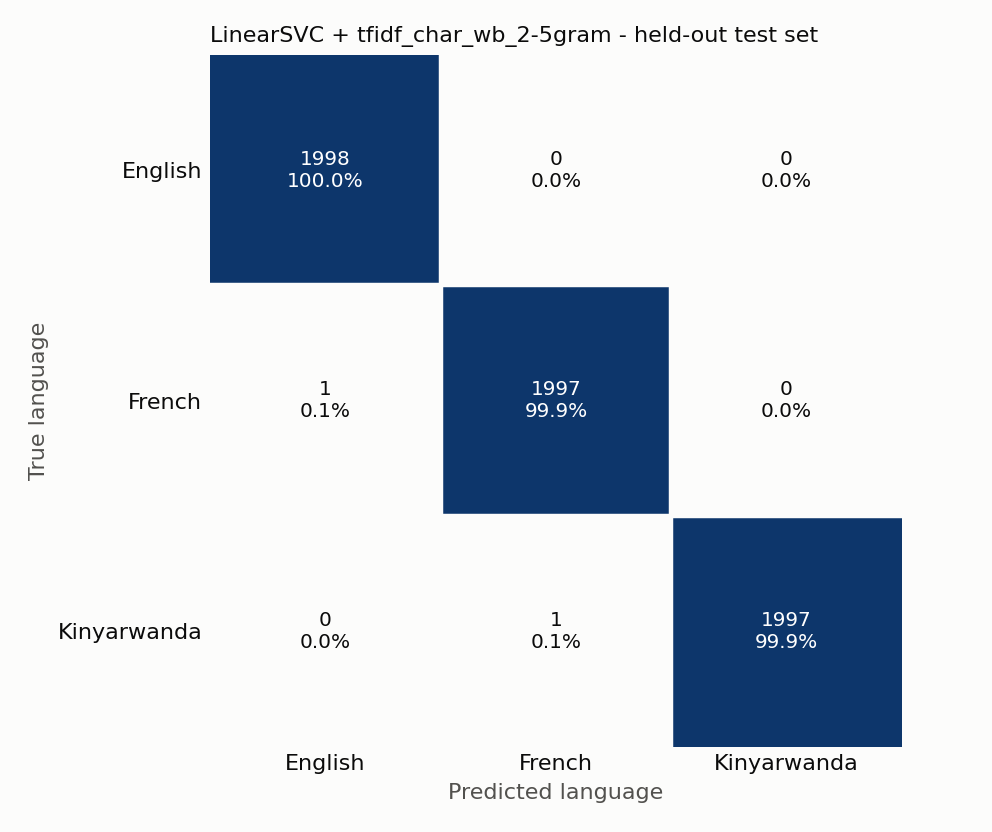
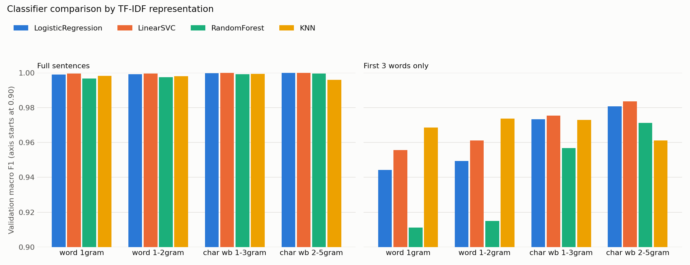
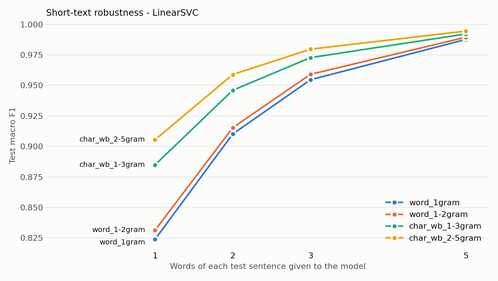
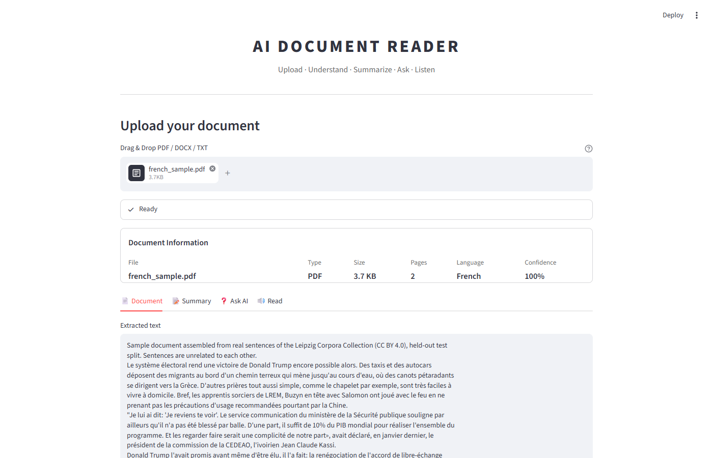
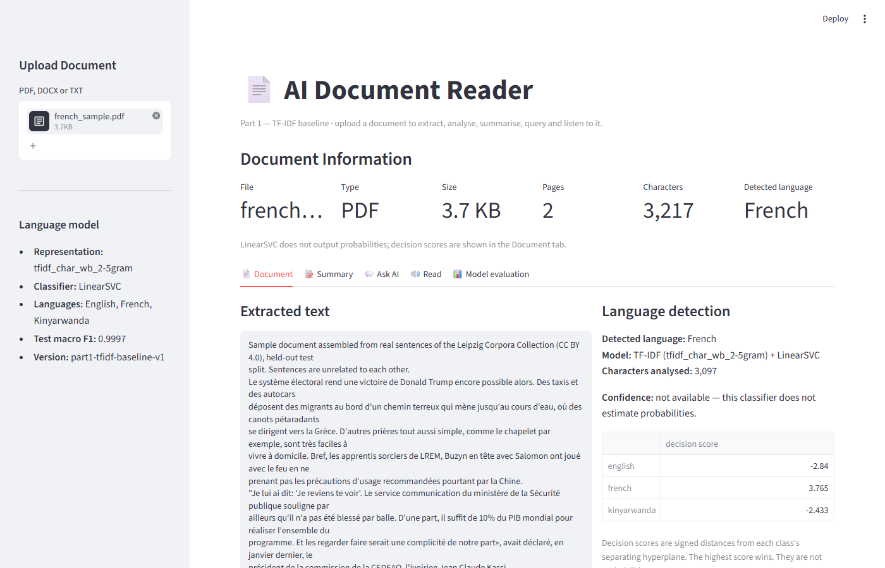
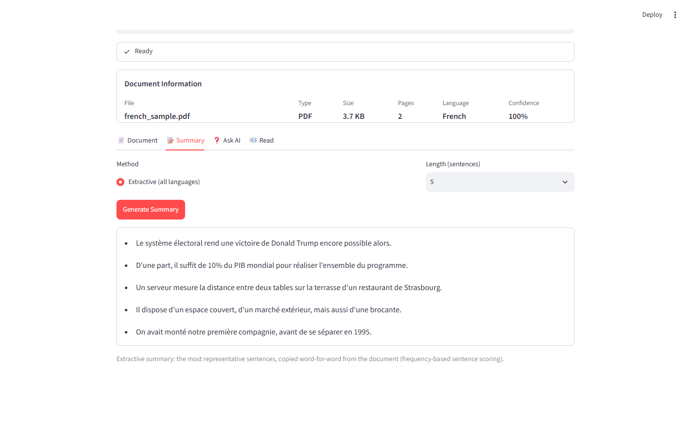
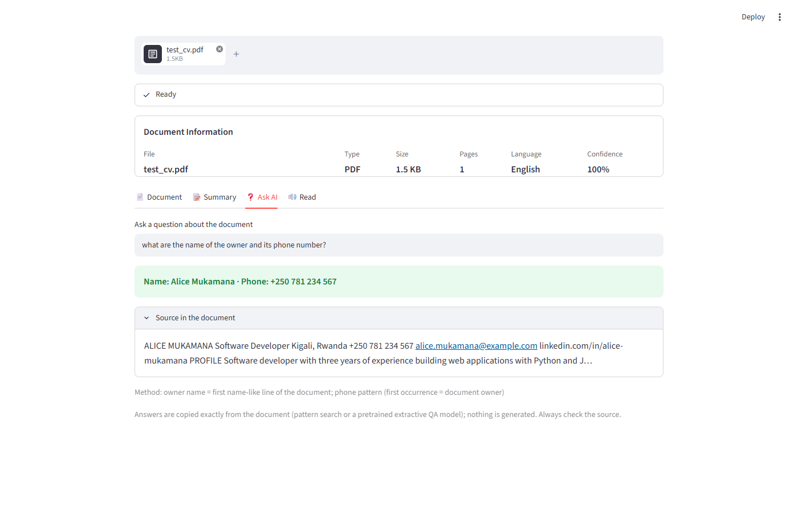
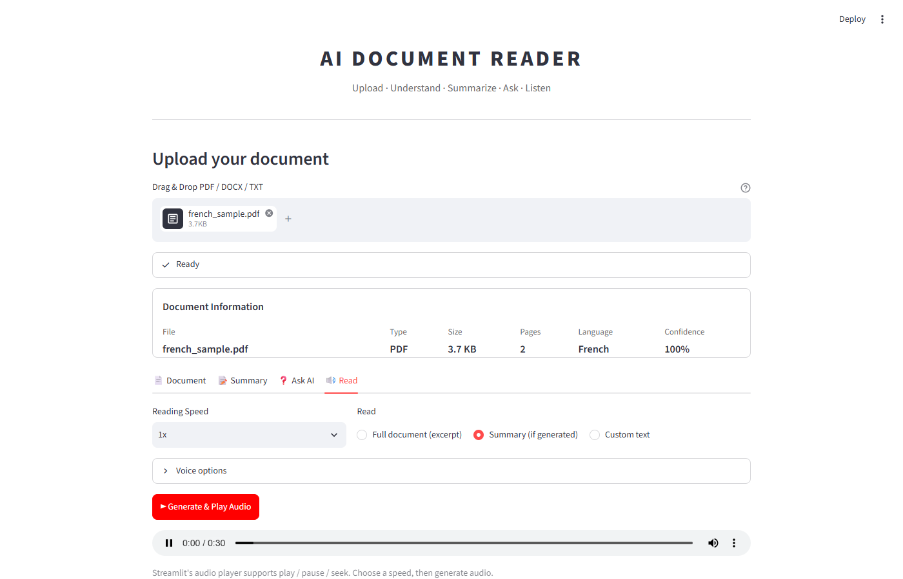

# AI Document Reader — NLP Baseline Version

> **Part 1 of 2 — TF-IDF baseline.** Upload a PDF, DOCX or TXT document; the
> system extracts and cleans the text, detects its language (English / French /
> Kinyarwanda) with a TF-IDF + machine-learning classifier, summarises it,
> answers questions about it and reads it aloud.

```
                      AI DOCUMENT READER
                              │
                         Upload File  (PDF · DOCX · TXT)
                              │
                              ▼
                       Text Extraction  (PyMuPDF · python-docx · Python I/O)
                              │
                              ▼
                       NLP Processing   (cleaning · tokenisation)
                              │
          ┌───────────────────┼─────────────────────────┐
          ▼                   ▼                         ▼
  Language Detection       Summary                     Q&A
  TF-IDF + ML classifier   extractive (frequency)      TF-IDF passage retrieval
  ★ main ML task ★         or pretrained DistilBART    + cosine similarity
          │                   │                         │
          └───────────────────┼─────────────────────────┘
                              ▼
                             TTS   (gTTS · pyttsx3 · pretrained MMS-TTS)
                              │
                              ▼
                            Speech
```

---

## Table of contents

1. [Problem statement](#1-problem-statement)
2. [Objectives](#2-objectives)
3. [Features](#3-features)
4. [Part 1 — TF-IDF Baseline](#4-part-1--tf-idf-baseline)
5. [NLP pipeline](#5-nlp-pipeline)
6. [Dataset](#6-dataset)
7. [TF-IDF representation](#7-tf-idf-representation)
8. [Models tested](#8-models-tested)
9. [Installation](#9-installation)
10. [Training](#10-training)
11. [Running the application](#11-running-the-application)
12. [Evaluation metrics](#12-evaluation-metrics)
13. [Actual results](#13-actual-results)
14. [Screenshots](#14-screenshots)
15. [Which model does what](#15-which-model-does-what)
16. [Project structure](#16-project-structure)
17. [Limitations](#17-limitations)
18. [Future improvements](#18-future-improvements)
19. [Part 2 — Word Embedding Improvement](#19-part-2--word-embedding-improvement)
20. [How the Machine Learning Works](#20-how-the-machine-learning-works)

---

## 1. Problem statement

Documents reach readers in many formats and, in Rwanda, frequently in one of three
languages: **Kinyarwanda, English or French**. Before a system can summarise,
search or read a document aloud, it must know *which language* it is dealing
with — the right summariser, question-answering behaviour and text-to-speech
voice all depend on it. Kinyarwanda is also a low-resource language that many
off-the-shelf tools do not support well.

This project builds an **AI Document Reader** whose central, supervised NLP task
is **language identification**, implemented as a transparent TF-IDF +
machine-learning baseline that can later be compared with word embeddings.

## 2. Objectives

- Extract text reliably from PDF, DOCX and TXT files.
- Build an explainable preprocessing pipeline that respects French accents and
  Kinyarwanda apostrophe contractions.
- Train and **fairly compare** four traditional classifiers on several TF-IDF
  representations (word vs. character n-grams) using one fixed, stratified split.
- Report **real, reproducible** metrics (accuracy, precision, recall, F1, macro F1,
  confusion matrix) — nothing invented.
- Integrate the best model into a Streamlit application with summary, question
  answering and text-to-speech.
- Keep the code modular so that **Part 2** can add word embeddings and compare.

## 3. Features

| Tab | What it does | Technique |
|---|---|---|
| **Upload / Document Information** | filename, type, size, pages (PDF), detected language, confidence | PyMuPDF, python-docx, trained TF-IDF model |
| **📄 Document** | full extracted text | PyMuPDF, python-docx |
| **📝 Summary** | extractive summary (any language) or abstractive summary (English) | frequency-based sentence scoring / pretrained `sshleifer/distilbart-cnn-12-6` |
| **❓ Ask AI** | gives the **exact answer** copied from the document (e.g. only the phone number) and shows its source | patterns + TF-IDF retrieval + pretrained extractive QA model |
| **🔊 Read** | reads the document, the summary or custom text aloud at 0.75x–1.5x speed | gTTS, pyttsx3, pretrained `facebook/mms-tts-kin` |

Model evaluation is **not** part of the interface: it is produced in code by the
training script (`results/`) for the report and presentation.

## 4. Part 1 — TF-IDF Baseline

This version is **intentionally a baseline**. Its machine-learning component
uses a *traditional, sparse* text representation — **TF-IDF** — with classic
classifiers. It deliberately does **not** use any word embeddings (no Word2Vec,
GloVe, FastText, sentence-transformers or transformer embeddings) for language
detection.

Why start with a baseline?

- It gives a **reference score** that any more complex method must beat.
- It is **fully explainable**: every feature is a visible word or character
  sequence with a weight.
- It is **fast and cheap** (training takes seconds on a laptop CPU).
- In Part 2 we will keep the same data, split, metrics and application and
  only change the representation, so the comparison is fair.

## 5. NLP pipeline

```
Raw document
  │  src/extraction/          PDF → PyMuPDF · DOCX → python-docx · TXT → UTF-8 (fallback cp1252/latin-1)
  ▼
Raw text
  │  src/preprocessing/       repair mojibake (’ → ') · Unicode NFC · lowercase
  │                           remove URLs, e-mails, digits, punctuation
  │                           keep accents (é, ç) and in-word apostrophes (nk'abandi, l'école)
  │                           collapse whitespace · drop empty documents
  ▼
Clean text ── tokenize() ──► tokens (for statistics, summary and Q&A)
  │
  │  src/language_detection/features.py   TfidfVectorizer (char_wb 2–5-grams)
  ▼
Sparse TF-IDF vector (99,533 dimensions)
  │  src/language_detection/detector.py   LinearSVC (probability-calibrated)
  ▼
Predicted language + confidence
```

**Stopwords.** Stopword removal is available (`remove_stopwords`) but is **off**
for language detection: function words such as *the*, *le*, *na* are among the
most informative clues for identifying a language. Stopwords are only removed
when scoring sentences for the extractive summary. The Kinyarwanda list is kept
deliberately short because Kinyarwanda is agglutinative — many grammatical
elements are prefixes attached to content words, so aggressive removal would
delete meaning.

### How Ask AI finds an exact answer

```
Question ─┬─► 1. Exact patterns (rule-based, explainable)
          │      phone · e-mail · link · owner's name · address · "Label: value" lines
          │      owner's details = first occurrence in the document;
          │      "phone of <Name>" = occurrence closest to that name
          │
          ├─► 2. TF-IDF retrieval of the top passages (+ start of the document)
          │      → pretrained extractive QA model (deepset/xlm-roberta-base-squad2)
          │        selects the exact answer span, or "no answer"
          │
          └─► 3. Fallback without the QA model: best-matching sentence
```

Example: *"what are the name of the owner and its phone number?"* →
**Name: Alice Mukamana · Phone: +250 781 234 567** (fictional test CV).

## 6. Dataset

| | |
|---|---|
| **Source** | [Leipzig Corpora Collection](https://wortschatz.uni-leipzig.de/en/download), Universität Leipzig — licence **CC BY 4.0** |
| **English** | `eng_news_2020_10K` — news sentences (2020) |
| **French** | `fra_news_2020_10K` — news sentences (2020) |
| **Kinyarwanda** | `kin_community_2017_10K` — web/community sentences (2017) |
| **Format** | `data/language_detection/{train,test}.csv` with columns `text,language` |
| **Size after cleaning** | 29,967 real sentences; balanced: 9,989 per language |
| **Split** | stratified, seed 42 → `train.csv` 23,973 · `test.csv` 5,994 |
| **Inside training** | `train.csv` is split again (stratified 80/20, seed 42) → 19,178 train · 4,795 validation |

The dataset is built by `training/prepare_dataset.py`, which downloads the
three corpora, removes sentences shorter than 3 words and duplicates, balances
the classes, and writes the split. No sentence is generated or synthetic.
See [data/language_detection/README.md](data/language_detection/README.md) for
the exact format and for how to use your own data instead.

```csv
text,language
"Hello, how are you today?",english
"Bonjour, comment allez-vous?",french
"Muraho, amakuru yawe?",kinyarwanda
```

The training script **stops with a clear error** if either CSV is missing, has
wrong columns, contains unknown labels, or has fewer than 10 samples for a language.

Citation: D. Goldhahn, T. Eckart & U. Quasthoff (2012). *Building Large Monolingual
Dictionaries at the Leipzig Corpora Collection: From 100 to 200 Languages.* LREC 2012.

## 7. TF-IDF representation

scikit-learn `TfidfVectorizer`, `sublinear_tf=True` (uses 1 + log(tf)), L2
normalisation, `min_df=2`. Four configurations are compared
(`src/language_detection/features.py`):

| Config | Analyzer | n-grams | Vocabulary | Captures |
|---|---|---|---|---|
| `tfidf_word_1gram` | word | 1 | 23,397 | individual words |
| `tfidf_word_1-2gram` | word | 1–2 | 56,105 | words + short phrases (*de la*, *mu Rwanda*) |
| `tfidf_char_wb_1-3gram` | char (within word boundaries) | 1–3 | 8,994 | letters and short spelling patterns |
| `tfidf_char_wb_2-5gram` | char (within word boundaries) | 2–5 | 99,533 | longer spelling patterns: *-tion*, *eau*, *nyi*, *rw*, *th* |

**Why character n-grams suit language identification:** each language has
typical letter sequences (English *th*, *ing*; French *eau*, *ois*, *é*;
Kinyarwanda *nyi*, *cy*, *rw*, frequent *aba-/umu-* prefixes). Character n-grams
recognise these even in words never seen in training, and they still work when
the text is only one or two words long — see the short-text results below.

## 8. Models tested

All from scikit-learn, all trained on exactly the same TF-IDF features and split
(`src/language_detection/classifiers.py`):

| Classifier | Settings | Idea |
|---|---|---|
| Logistic Regression | `C=10, max_iter=2000` | linear model, outputs probabilities |
| LinearSVC | `C=1.0` | linear max-margin separator; no probabilities, outputs decision scores |
| Random Forest | `n_estimators=200` | ensemble of decision trees |
| K-Nearest Neighbors | `k=5, metric=cosine` | majority vote of the 5 most similar training sentences |

**Probability calibration.** LinearSVC does not output probabilities, but the
app shows a confidence. After selection, the chosen LinearSVC is therefore
wrapped in `CalibratedClassifierCV` (sigmoid / Platt scaling, 5-fold
cross-validation on the training split only). The deployed, calibrated model is
re-evaluated on the test set (§13.2) and gives the same test results.

**Model selection rule:** highest **validation macro F1**. When models tie, the
tie is broken by validation macro F1 on **3-word snippets** of the validation
sentences (robustness to short text), then by training time. The test set is
**never** used for selection — only for the final report.

## 9. Installation

Requires Python 3.10+ (developed with Python 3.13).

```bash
cd ai-document-reader
python -m venv .venv
.venv\Scripts\activate          # Windows   (macOS/Linux: source .venv/bin/activate)
python -m pip install -r requirements.txt
```

Pretrained models (exact answers in Ask AI, English abstractive summary, Kinyarwanda TTS — large downloads; `requirements.txt` already lists them):

```bash
python -m pip install torch --index-url https://download.pytorch.org/whl/cpu
python -m pip install transformers sentencepiece
```

> **Important:** install the packages into the **same** Python environment that
> runs Streamlit. Using `python -m pip` and `python -m streamlit` (with the
> environment activated) guarantees this. A message such as
> *"No module named 'pymupdf'"* means the app is running in a different
> environment from the one the packages were installed in.

## 10. Training

```bash
# 1. Build the dataset from the real Leipzig corpora (≈ 8 MB download, cached)
python training/prepare_dataset.py

# 2. Train, compare and evaluate all TF-IDF configurations × classifiers
python training/train_language_detection.py
```

Takes about one minute on a laptop CPU. Options:

```bash
python training/train_language_detection.py --configs tfidf_char_wb_2-5gram tfidf_word_1gram
python training/train_language_detection.py --classifiers LogisticRegression LinearSVC
python training/train_language_detection.py --val-size 0.2 --seed 42
```

**Outputs**

| Path | Content |
|---|---|
| `models/language_detection/tfidf_vectorizer.pkl` | fitted TF-IDF vectorizer of the selected configuration |
| `models/language_detection/best_model.pkl` | selected classifier |
| `models/language_detection/metadata.json` | vectorizer settings, classifier + parameters, languages, metrics, preprocessing, training date, version, seed |
| `models/language_detection/classifiers/*.pkl` | all four classifiers for the selected config (git-ignored; ~100 MB because of Random Forest) |
| `results/language_detection_results.csv` | every config × classifier × split: accuracy, macro precision/recall/F1, weighted F1, 3-word F1, training time |
| `results/tfidf_config_comparison.csv` | best and mean validation F1 per TF-IDF config |
| `results/short_text_robustness.csv` | test macro F1 on the first 1/2/3/5 words of every sentence |
| `results/classification_report.txt` | per-class report + confusion matrix of the selected model |
| `results/confusion_matrix.png`, `confusion_matrices_all_classifiers.png`, `model_comparison.png`, `short_text_robustness.png` | charts |
| `results/training_log.txt` | full console output of the run reported below |

## 11. Running the application

```bash
python -m streamlit run app.py
```

Open <http://localhost:8501>, upload a document (try the files in `samples/`),
and explore the tabs. If the model has not been trained, the app shows the
commands to run instead of crashing.

`samples/` contains an English TXT, a French PDF and a Kinyarwanda DOCX built
from real held-out test sentences (they are unrelated sentences, so summaries
and answers are only meant to demonstrate the mechanics).

## 12. Evaluation metrics

| Metric | Meaning |
|---|---|
| **Accuracy** | share of sentences whose language was predicted correctly |
| **Precision** (per language) | of the sentences predicted as language L, how many really are L |
| **Recall** (per language) | of the sentences that really are L, how many were found |
| **F1-score** | harmonic mean of precision and recall |
| **Macro F1** | average of the per-language F1 scores — every language counts equally (important so Kinyarwanda is not hidden by the others) |
| **Confusion matrix** | rows = true language, columns = predicted language |

**Confidence ≠ accuracy.** In the app, *confidence* (the calibrated probability
of the predicted language) describes how
strongly the model prefers a language **for that one document**. *Accuracy/F1*
describe how often the model was right on the **held-out test set**.

## 13. Actual results

All numbers below were produced by `python training/train_language_detection.py`
on 2026-10-02 (seed 42) and are copied from the files in `results/`. Re-running
the script reproduces them; small differences in training *time* are expected.

### 13.1 All models (sorted by selection rule)

Macro-averaged. Validation = 4,795 sentences, test = 5,994 sentences.

| TF-IDF config | Classifier | Val acc | Val macro F1 | Val F1 (3 words) | Test acc | Test precision | Test recall | Test macro F1 |
|---|---|---:|---:|---:|---:|---:|---:|---:|
| **char_wb 2–5** | **LinearSVC** ★ | 1.0000 | **1.0000** | **0.9835** | 0.9997 | 0.9997 | 0.9997 | **0.9997** |
| char_wb 2–5 | LogisticRegression | 1.0000 | 1.0000 | 0.9808 | 0.9997 | 0.9997 | 0.9997 | 0.9997 |
| char_wb 1–3 | LinearSVC | 1.0000 | 1.0000 | 0.9754 | 0.9998 | 0.9998 | 0.9998 | 0.9998 |
| char_wb 1–3 | LogisticRegression | 0.9998 | 0.9998 | 0.9734 | 0.9997 | 0.9997 | 0.9997 | 0.9997 |
| char_wb 2–5 | RandomForest | 0.9996 | 0.9996 | 0.9711 | 0.9995 | 0.9995 | 0.9995 | 0.9995 |
| word 1–2 | LinearSVC | 0.9996 | 0.9996 | 0.9611 | 0.9997 | 0.9997 | 0.9997 | 0.9997 |
| word 1 | LinearSVC | 0.9996 | 0.9996 | 0.9556 | 0.9995 | 0.9995 | 0.9995 | 0.9995 |
| char_wb 1–3 | KNN | 0.9994 | 0.9994 | 0.9729 | 0.9990 | 0.9990 | 0.9990 | 0.9990 |
| char_wb 1–3 | RandomForest | 0.9992 | 0.9992 | 0.9565 | 0.9990 | 0.9990 | 0.9990 | 0.9990 |
| word 1–2 | LogisticRegression | 0.9992 | 0.9992 | 0.9495 | 0.9995 | 0.9995 | 0.9995 | 0.9995 |
| word 1 | LogisticRegression | 0.9990 | 0.9990 | 0.9443 | 0.9993 | 0.9993 | 0.9993 | 0.9993 |
| word 1 | KNN | 0.9983 | 0.9983 | 0.9685 | 0.9978 | 0.9978 | 0.9978 | 0.9978 |
| word 1–2 | KNN | 0.9981 | 0.9981 | 0.9738 | 0.9988 | 0.9988 | 0.9988 | 0.9988 |
| word 1–2 | RandomForest | 0.9975 | 0.9975 | 0.9149 | 0.9978 | 0.9978 | 0.9978 | 0.9978 |
| word 1 | RandomForest | 0.9967 | 0.9967 | 0.9113 | 0.9975 | 0.9975 | 0.9975 | 0.9975 |
| char_wb 2–5 | KNN | 0.9960 | 0.9960 | 0.9611 | 0.9960 | 0.9960 | 0.9960 | 0.9960 |

★ **Selected model: LinearSVC + TF-IDF character (word-boundary) 2–5-grams**
(deployed with probability calibration, see §8).
Three combinations tie at validation macro F1 = 1.0000; the tie-break (3-word
validation F1) selects LinearSVC + char_wb 2–5 (0.9835 vs 0.9808 and 0.9754).

### 13.2 Deployed model (calibrated LinearSVC) on the held-out test set

Calibration did not change any test prediction: the uncalibrated and
calibrated LinearSVC both reach accuracy and macro F1 = 0.9997.

```
              precision    recall  f1-score   support

     english     0.9995    1.0000    0.9997      1998
      french     0.9995    0.9995    0.9995      1998
 kinyarwanda     1.0000    0.9995    0.9997      1998

    accuracy                         0.9997      5994
   macro avg     0.9997    0.9997    0.9997      5994
```



Only **2 of 5,994** test sentences were misclassified, and both are instructive:

| True | Predicted | Sentence | Why |
|---|---|---|---|
| kinyarwanda | french | *Ni ukwica intellectuellement generation yose.* | code-switching: two of five words are French |
| french | english | *Jennifer Aniston et Steve Carrell dans la série "The Morning Show".* | dominated by English names and an English title |

### 13.3 Word vs. character n-grams

On **full sentences** every configuration is above 0.996 macro F1 — telling
these three languages apart from a complete sentence is easy for any reasonable
representation. The differences appear on **short text**:



Test macro F1 (LinearSVC) when the model only sees the **first N words** of
each test sentence (`results/short_text_robustness.csv`):

| TF-IDF config | 1 word | 2 words | 3 words | 5 words |
|---|---:|---:|---:|---:|
| word 1-gram | 0.8239 | 0.9102 | 0.9546 | 0.9877 |
| word 1–2-gram | 0.8313 | 0.9153 | 0.9591 | 0.9895 |
| char_wb 1–3-gram | 0.8849 | 0.9460 | 0.9727 | 0.9922 |
| **char_wb 2–5-gram** | **0.9055** | **0.9589** | **0.9797** | **0.9945** |



**Conclusion.** Character n-grams perform better, especially on short inputs:
with a single word, char 2–5-grams reach 0.906 macro F1 vs. 0.824 for word
unigrams. A word model can only use words seen in training; a character model
still recognises spelling patterns in unseen words, names and inflections —
very relevant for Kinyarwanda, where one stem appears with many different
prefixes. Among classifiers, the linear models (LinearSVC, Logistic Regression)
are best and fastest on high-dimensional sparse TF-IDF; Random Forest is the
weakest on short text and the slowest; KNN is competitive on very short inputs
but the least accurate on full sentences with char 2–5-grams.

## 14. Screenshots

Captured from the running app with `samples/french_sample.pdf`.



| Document tab | Summary tab |
|---|---|
|  |  |
| **Ask AI tab** | **Read tab** |
|  |  |

Evaluation charts for the presentation are in `results/` (see §13).

## 15. Which model does what

| Task | Model / method | Trained by us? |
|---|---|---|
| **Language detection (main ML task)** | TF-IDF char_wb 2–5-grams + **LinearSVC** (calibrated) | ✅ **yes** — `training/train_language_detection.py` |
| Extractive summary | frequency-based sentence scoring (no ML model) | — rule-based |
| Abstractive summary (English only, optional) | pretrained `sshleifer/distilbart-cnn-12-6` | ❌ no, pretrained |
| Question answering — contact details & fields | patterns for phone / e-mail / link, owner's name, address, `Label: value` lines | — rule-based |
| Question answering — other questions | TF-IDF passage retrieval (per document) + pretrained extractive QA model `deepset/xlm-roberta-base-squad2` | ❌ no, pretrained (retrieval index fitted per document) |
| TTS English/French | Google TTS (gTTS, online) or OS voices (pyttsx3, offline) | ❌ no |
| TTS Kinyarwanda | pretrained Meta MMS `facebook/mms-tts-kin` (CC-BY-NC 4.0); fallback = Swahili voice, labelled as an approximation | ❌ no |

The TF-IDF used for question answering is a **separate**, per-document
retrieval index; it is not the language-detection vectorizer.

## 16. Project structure

```
ai-document-reader/
├── app.py                              Streamlit application
├── README.md
├── requirements.txt
├── .gitignore
├── data/language_detection/
│   ├── README.md                       dataset format, source and licence
│   ├── train.csv                       23,973 real sentences
│   └── test.csv                         5,994 real sentences
├── training/
│   ├── prepare_dataset.py              downloads + builds the dataset
│   └── train_language_detection.py     trains, compares, evaluates, saves
├── models/language_detection/
│   ├── tfidf_vectorizer.pkl
│   ├── best_model.pkl
│   └── metadata.json
├── src/
│   ├── config.py                       paths, labels, seed
│   ├── extraction/                     PDF / DOCX / TXT → text
│   ├── preprocessing/                  cleaning, tokenisation, stopwords, stats
│   ├── language_detection/
│   │   ├── features.py                 representation registry (TF-IDF now; embeddings in Part 2)
│   │   ├── classifiers.py              the 4 classifiers
│   │   └── detector.py                 loads model, predicts language
│   ├── summarization/                  extractive + optional pretrained abstractive
│   ├── question_answering/             exact answers: patterns + retrieval + extractive QA model
│   └── tts/                            gTTS, pyttsx3, MMS-TTS
├── results/                            metrics CSVs, report, charts, training log
├── samples/                            demo TXT / PDF / DOCX
└── docs/screenshots/
```

## 17. Limitations

- **Closed set of three languages.** Any other language (e.g. Swahili, Spanish)
  is still forced into English, French or Kinyarwanda. There is no "unknown" class.
- **Mixed-language documents** get a single label for the whole document; code-
  switching (common in Kinyarwanda writing) is a known error source (see §13.2).
- **Domain difference between classes.** English and French come from 2020 news,
  Kinyarwanda from 2017 web/community text. Part of what the model learns may be
  topic or style rather than language, and the near-perfect scores partly reflect
  how easy full-sentence identification of these three languages is.
- **Sentence-level training, document-level use.** The model is trained on
  sentences; documents are classified from their first 20,000 cleaned characters.
- **Confidence comes from calibration.** LinearSVC's probabilities are produced by
  Platt scaling; on very easy inputs they are often close to 100%, which says
  nothing about how the model behaves on other documents.
- **No OCR.** Scanned PDFs contain images, not text, and are reported as empty.
- **Q&A answers are only as good as their method.** Patterns assume common layouts
  (the owner's details come first in a CV; a name is a short capitalised line).
  The pretrained QA model can pick a wrong span — e.g. a past job for "current
  job" — or guess when the answer is not in the document. It never generates
  text, and the source is always shown so the answer can be checked. It does
  not support Kinyarwanda well.
- **Summaries.** The extractive method only selects sentences; the abstractive model
  is English-only and requires a large download.
- **Kinyarwanda TTS is limited.** It depends on a pretrained research model (non-
  commercial licence) that must be downloaded; there is no offline Kinyarwanda voice.

## 18. Future improvements

- **Word embeddings for language detection and Q&A (Part 2).**
- Add an "other/unknown" class and a confidence threshold.
- Sentence- or paragraph-level detection to handle mixed-language documents.
- Larger and more varied data per language (same domains for all three).
- OCR (e.g. Tesseract) for scanned PDFs.
- Multilingual summarisation, including Kinyarwanda.

## 19. Part 2 — Word Embedding Improvement

Part 2 will **continue this same codebase and Git history**. It will replace or
extend the TF-IDF representation with **word embeddings** and compare the results
against the Part 1 baseline reported in §13.

Planned approach:

1. Add embedding representations to the registry in
   `src/language_detection/features.py` (e.g. averaged word vectors), using the
   same `fit` / `transform` interface as `TfidfVectorizer`.
2. Re-run `training/train_language_detection.py` with the **same dataset, split,
   seed, classifiers and metrics**, so only the representation changes.
3. Compare TF-IDF vs. embeddings on full sentences **and** on the short-text
   benchmark (`results/short_text_robustness.csv`), where the baseline still has
   room to improve (0.906 macro F1 on single words).
4. Optionally use embeddings for semantic retrieval in the Ask AI tab, so that
   questions using synonyms can still find the right passage.

The app loads its model through `LanguageDetector` and `metadata.json`, so a new
representation can be plugged in without rewriting the interface.

## 20. How the Machine Learning Works

```
Raw text           "Abana bagiye ku ishuri uyu munsi."
   │
   ▼
Preprocessing      "abana bagiye ku ishuri uyu munsi"
   │               (lowercase, remove punctuation/digits, keep accents & apostrophes)
   ▼
TF-IDF             sparse vector: one weight per character n-gram
representation     " ab", "aba", "bana", "agiy", "ishu", "uri ", ...
   │
   ▼
ML classifier      LinearSVC scores each language; calibration turns the scores into probabilities:
   │               english 0.01% · french 0.04% · kinyarwanda 99.95%
   ▼
Language           highest probability → kinyarwanda (confidence 99.95%)
prediction
   │
   ▼
Evaluation         compare predictions with true labels on unseen test data
                   → accuracy, precision, recall, F1, macro F1, confusion matrix
```

*(Probabilities shown are real outputs of the deployed model for that sentence.)*

### What does TF-IDF mean?

**TF — Term Frequency:** how often a term (a word, or here a character n-gram)
appears in a document. A term that appears often in a text is probably
characteristic of it.

**IDF — Inverse Document Frequency:** how *rare* the term is across all
documents in the training set:

  IDF(t) = ln( (1 + N) / (1 + df(t)) ) + 1  (N = number of documents, df = documents containing t)

A term that appears everywhere (like a space followed by "a") has a low IDF; a
term that appears in only some documents (like "nyi" or "eau") has a high IDF.

**TF-IDF = TF × IDF.** It gives **important, distinctive terms higher weights and
common, uninformative terms lower weights.** Each document becomes a long vector
of these weights (normalised to length 1), which a classifier can learn from.

### How does the classifier use it?

The classifier learns, from labelled examples, which TF-IDF features point to
which language. A linear model such as LinearSVC learns one weight per feature
per language: n-grams like "th" or "ing" push towards English, "eau" or "é" towards
French, "nyi" or "rw" towards Kinyarwanda. For a new document it adds up
*feature value × weight* for each language and picks the highest total.

### Why is TF-IDF a good baseline before embeddings?

- **Simple and transparent** — every dimension is a readable word or character
  sequence; we can inspect exactly why a decision was made.
- **Fast** — training on ~19,000 sentences takes seconds on a CPU; no GPU or
  pretrained model needed.
- **Strong for this task** — language identity is largely visible in spelling, which
  character TF-IDF captures directly.
- **Language-independent** — needs no pretrained resources, which matters for a
  low-resource language like Kinyarwanda.
- **A fair yardstick** — embeddings capture *meaning* and similarity between words
  (e.g. "car" ≈ "automobile"), which TF-IDF cannot. Part 2 will measure whether that
  extra knowledge actually improves language detection and question answering,
  compared against the numbers above.
